# Classificação de Doença Hepática com Machine Learning e Explicabilidade (SHAP)

Pipeline completa em **R** para predição de doença hepática a partir de exames laboratoriais, usando o dataset **Indian Liver Patient Dataset (ILPD)**. O projeto compara quatro algoritmos de classificação com validação cruzada repetida, avalia-os em um conjunto de teste independente e explica as decisões do modelo com **valores SHAP**.

---

## Sumário

1. [Visão geral](#1-visão-geral)
2. [O problema](#2-o-problema)
3. [O dataset](#3-o-dataset)
4. [Estrutura do projeto](#4-estrutura-do-projeto)
5. [Como executar](#5-como-executar)
6. [Metodologia — etapa por etapa](#6-metodologia--etapa-por-etapa)
7. [Resultados obtidos](#7-resultados-obtidos)
8. [Explicabilidade — como interpretar os gráficos SHAP](#8-explicabilidade--como-interpretar-os-gráficos-shap)
9. [Decisões metodológicas e justificativas](#9-decisões-metodológicas-e-justificativas)
10. [Limitações e trabalhos futuros](#10-limitações-e-trabalhos-futuros)
11. [Referências](#11-referências)

---

## 1. Visão geral

```
CSV bruto ──► EDA ──► Pré-processamento ──► SMOTE (só treino) ──► Treino 4 modelos (CV 5x3)
                                                                          │
                              SHAP (explicabilidade) ◄── Avaliação no teste ◄──┘
```

| Item | Detalhe |
|---|---|
| Linguagem | R 4.5 |
| Framework de modelagem | `caret` (validação cruzada, tuning, comparação) |
| Modelos | Regressão Logística, Random Forest, XGBoost, LightGBM |
| Balanceamento | SMOTE (aplicado apenas no treino) |
| Métrica de seleção | AUC-ROC |
| Explicabilidade | SHAP via `fastshap` + `shapviz` |
| Reprodutibilidade | Seed global `42` em todas as etapas |
| Tempo total de execução | ≈ 10 min (dominado pelo tuning do XGBoost) |

---

## 2. O problema

Doenças hepáticas frequentemente são silenciosas nos estágios iniciais. Exames de sangue de rotina (bilirrubina, enzimas hepáticas, proteínas) carregam sinais que podem indicar comprometimento do fígado antes de sintomas clínicos.

**Objetivo:** dado um conjunto de exames laboratoriais + idade + sexo, prever se o paciente é **doente hepático (classe positiva)** ou **saudável**.

**Contexto clínico da métrica:** em triagem, o erro mais grave é o **falso negativo** (dizer que um doente está saudável). Por isso o projeto dá ênfase a **sensibilidade (recall)** e **AUC-ROC**, e não apenas à acurácia.

---

## 3. O dataset

**Indian Liver Patient Dataset (ILPD)** — UCI Machine Learning Repository.
583 pacientes coletados no nordeste de Andhra Pradesh, Índia.

| Variável | Descrição | Tipo |
|---|---|---|
| `Age` | Idade do paciente | numérica |
| `Gender` | Sexo (Male / Female) | categórica |
| `Total_Bilirubin` | Bilirrubina total (mg/dL) | numérica |
| `Direct_Bilirubin` | Bilirrubina direta (mg/dL) | numérica |
| `Alkaline_Phosphotase` | Fosfatase alcalina (IU/L) | numérica |
| `Alamine_Aminotransferase` | ALT / TGP (IU/L) | numérica |
| `Aspartate_Aminotransferase` | AST / TGO (IU/L) | numérica |
| `Total_Proteins` | Proteínas totais (g/dL) | numérica |
| `Albumin` | Albumina (g/dL) | numérica |
| `AG_Ratio` | Razão albumina/globulina | numérica |
| `Dataset` | **Alvo**: 1 = doente, 2 = saudável | binária |

Características relevantes descobertas na EDA:

- **Desbalanceamento**: ~71% doentes vs ~29% saudáveis (razão ≈ 2,5 : 1).
- **4 valores ausentes** em `AG_Ratio`.
- **13 linhas duplicadas**.
- **Forte assimetria** (skewness > 2) nas bilirrubinas e nas enzimas — típico de exames laboratoriais, onde poucos pacientes têm valores extremamente altos.
- **Alta correlação** entre `Total_Bilirubin` × `Direct_Bilirubin` e entre `ALT` × `AST` (esperado: medem processos fisiológicos relacionados).

---

## 4. Estrutura do projeto

```
workspace/
├── ExecutarTudo.R              # Orquestrador: roda tudo, cronometra e grava log
├── UtilsPipeline.R             # Funções de log, persistência e wrapper LightGBM p/ caret
├── 0.InstalarPacotes.R         # Verifica/instala dependências (versões fixadas)
├── 1.CarregamentoDeDados.R     # Leitura + análise exploratória (EDA)
├── 2.PreProcessamento.R        # Limpeza, encoding, log-transform, split, normalização
├── 3.Balanceamento.R           # SMOTE no conjunto de treino
├── 4.Modelos.R                 # Treino dos 4 modelos com CV repetida
├── 5.Avaliacao.R               # Avaliação no teste: métricas, ROC, PR, DeLong, limiar
├── 6.SHAP.R                    # Explicabilidade global e local
│
├── data/
│   ├── Indian Liver Patient Dataset (ILPD).csv   # dados brutos
│   ├── df_raw.rds              # dados carregados
│   ├── df_proc.rds             # treino pré-processado (antes do SMOTE)
│   ├── df_balanceado.rds       # treino após SMOTE
│   ├── teste.rds               # teste (nunca tocado pelo SMOTE)
│   └── preproc.rds             # parâmetros de normalização (média/DP do treino)
│
├── models/                     # modelos treinados (.rds, objetos caret)
│   ├── modelo_lr.rds
│   ├── modelo_rf.rds
│   ├── modelo_xgb.rds
│   └── modelo_lgb.rds
│
├── results/                    # tabelas em CSV prontas para o texto do TCC
│   ├── estatisticas_descritivas.csv
│   ├── comparacao_medias_por_classe.csv
│   ├── coeficientes_regressao_logistica.csv
│   ├── cv_auc_por_modelo.csv
│   ├── metricas_teste.csv
│   ├── delong_pareado.csv
│   ├── analise_limiar_melhor_modelo.csv
│   ├── shap_importancia.csv
│   ├── shap_direcao_efeito.csv
│   └── comparacao_importancia_shap_rf_lgb.csv
│
├── plots/                      # figuras (PNG, 150 dpi)
│   ├── eda_*.png               # exploração
│   ├── smote_antes_depois.png
│   ├── cv_comparacao_modelos.png
│   ├── roc_teste.png / precision_recall_teste.png / metricas_teste.png
│   └── shap_*.png              # importância, beeswarm, dependência, waterfall
│
└── logs/
    └── pipeline_<timestamp>.log   # cópia integral do console de cada execução
```

---

## 5. Como executar

### Pré-requisitos

- R ≥ 4.3 (testado em 4.5.0)
- Acesso à internet na primeira execução (instalação de pacotes)

### Execução completa

No RStudio / DataSpell, com o diretório de trabalho na raiz do projeto:

```r
source("ExecutarTudo.R")
```

Ou pelo terminal:

```bash
Rscript ExecutarTudo.R
```

O script:

1. Verifica e instala pacotes faltantes (`0.InstalarPacotes.R`).
2. Executa as etapas 1 → 6 em sequência.
3. Cronometra cada etapa.
4. Espelha **todo** o console em `logs/pipeline_<timestamp>.log`.
5. Interrompe com mensagem clara se alguma etapa falhar.

### Execução por etapa

Cada script é independente e pode ser rodado isoladamente, desde que os artefatos da etapa anterior existam em `data/` ou `models/`:

```r
source("5.Avaliacao.R")   # reavalia os modelos já treinados sem retreinar
source("6.SHAP.R")        # recalcula só a explicabilidade
```

### Versões fixadas (por quê)

| Pacote | Versão | Motivo |
|---|---|---|
| `xgboost` | 1.7.8.1 | Versões 2.x quebram a integração com `caret::train(method = "xgbTree")` |
| `fastshap` | 0.1.1 | Pacote arquivado no CRAN; instalado a partir do archive |

---

## 6. Metodologia — etapa por etapa

### Etapa 0 — Instalação de pacotes

Verifica cada dependência e instala apenas o que falta. Registra no log a versão do R, a plataforma e a seed global. Fixa `xgboost` e `fastshap` nas versões compatíveis.

### Etapa 1 — Carregamento e análise exploratória

- Leitura do CSV com nomes de colunas explícitos.
- Tipos das variáveis, contagem de `NA` e duplicatas.
- Distribuição da variável alvo e razão de desbalanceamento.
- Tabela cruzada sexo × classe.
- Estatísticas descritivas (média, DP, mín, mediana, máx, **assimetria**) → `results/estatisticas_descritivas.csv`.
- **Teste t de Welch** comparando a média de cada exame entre doentes e saudáveis → identifica quais variáveis já discriminam as classes univariadamente.
- Matriz de correlação de Pearson com alerta para pares com |r| > 0,7.
- Gráficos: distribuição do alvo, boxplots por classe, heatmap de correlação.

### Etapa 2 — Pré-processamento

| Passo | O que faz | Por quê |
|---|---|---|
| Remoção de duplicatas | 583 → 570 linhas | Duplicatas inflam artificialmente a confiança e podem vazar entre treino e teste |
| Imputação | `AG_Ratio` ausente ← mediana (0,95) | Mediana é robusta a outliers; apenas 4 casos |
| Encoding | `Gender`: Male=1, Female=0; `Dataset`: `"doente"` / `"saudavel"` | `caret` exige rótulos textuais válidos para calcular probabilidades |
| Transformação `log1p` | Bilirrubinas, fosfatase alcalina, ALT, AST | Reduz assimetria extrema; melhora modelos lineares e a estabilidade do SMOTE |
| **Split estratificado 80/20** | 457 treino / 113 teste | Estratificação garante a mesma proporção de classes nos dois conjuntos (71,1% vs 71,7%) |
| Normalização (center + scale) | Ajustada **somente no treino**, aplicada ao teste | Evita **data leakage**: o teste não pode influenciar os parâmetros de escala |

> **Ponto crítico:** o split é feito **antes** do SMOTE e da normalização. Se fosse depois, amostras sintéticas geradas a partir de pacientes do teste contaminariam o treino, e as métricas ficariam otimistas.

### Etapa 3 — Balanceamento com SMOTE

- SMOTE (Synthetic Minority Over-sampling Technique) com `K = 5` vizinhos.
- Aplicado **exclusivamente no treino**: 457 → 589 observações (132 sintéticas).
- O teste mantém a distribuição real (71,7% doentes) para uma avaliação honesta.
- Verificação de integridade: compara as médias das amostras sintéticas com as originais.
- Gráfico antes/depois.

### Etapa 4 — Treinamento dos modelos

**Validação cruzada repetida: 5 folds × 3 repetições = 15 avaliações por combinação de hiperparâmetros.** A métrica de seleção é a **AUC-ROC**.

| Modelo | Tipo | Hiperparâmetros otimizados |
|---|---|---|
| **Regressão Logística** | Linear, interpretável (baseline) | — |
| **Random Forest** | Bagging de 500 árvores | `mtry` (5 valores) |
| **XGBoost** | Gradient boosting | `nrounds`, `max_depth`, `eta`, `gamma`, `colsample_bytree`, `min_child_weight` (grade automática do caret, `tuneLength = 5`) |
| **LightGBM** | Gradient boosting (histogram-based) | `num_leaves`, `learning_rate`, `nrounds`, `feature_fraction` (24 combinações) |

O `caret` não possui método nativo para LightGBM, então `UtilsPipeline.R` define um **wrapper customizado** (`lightgbm_caret`) implementando as funções `fit`, `predict`, `prob`, `varImp` e `grid`. Isso permite que o LightGBM participe da mesma validação cruzada e da comparação via `resamples()`, em pé de igualdade com os demais.

Saídas adicionais:

- **Coeficientes e odds ratios** da regressão logística com p-valores → interpretação direta do efeito de cada exame.
- Boxplot da AUC nos 15 folds para cada modelo.
- **Teste t pareado com correção de Bonferroni** entre modelos (`diff(resamples)`): as diferenças de AUC são estatisticamente significativas?

### Etapa 5 — Avaliação no conjunto de teste

Para cada modelo:

- Matriz de confusão com VP / FP / FN / VN.
- Acurácia, acurácia balanceada, sensibilidade, especificidade, precisão, F1, Kappa, AUC.
- **Intervalo de confiança de 95% da AUC** pelo método de **DeLong**.
- **Limiar ótimo pelo índice de Youden** (maximiza Sens + Spec − 1).

Comparação entre modelos:

- Tabela consolidada → `results/metricas_teste.csv`.
- **Teste de DeLong pareado** para todas as combinações de modelos.
- Curvas ROC sobrepostas, curvas Precision-Recall, gráfico de barras de métricas.
- **Análise de sensibilidade ao limiar** (0,1 a 0,9) para o melhor modelo — mostra o trade-off sensibilidade × especificidade que um clínico precisaria escolher.

### Etapa 6 — Explicabilidade com SHAP

Aplicada ao **XGBoost** sobre o conjunto de teste (SHAP via Monte Carlo, `nsim = 100`).

| Saída | O que responde |
|---|---|
| `shap_importancia.png` + `.csv` | Quais variáveis mais pesam nas decisões, em média? |
| `shap_beeswarm.png` | Em qual direção cada variável empurra a previsão? |
| `shap_direcao_efeito.csv` | Correlação valor-da-variável × SHAP, com interpretação textual |
| `shap_dependencia_<var>.png` | Como o efeito muda conforme o valor da variável (4 mais importantes) |
| `shap_waterfall_*.png` | Por que o modelo decidiu assim para **um paciente específico**? Três casos: o verdadeiro positivo mais confiante, o verdadeiro negativo mais confiante e o **pior falso negativo** |
| `comparacao_importancia_shap_rf_lgb.csv` | O ranking SHAP concorda com a importância nativa do RF e do LightGBM? (Spearman) |

---

## 7. Resultados obtidos

> Valores da execução de referência (`logs/pipeline_20260912_180242.log`). Podem variar levemente entre máquinas por diferenças de paralelismo, mas a seed fixa (`42`) garante reprodutibilidade na mesma máquina. Todas as tabelas estão em `results/` e todas as figuras em `plots/`.

### 7.1 Análise exploratória

#### Desbalanceamento das classes

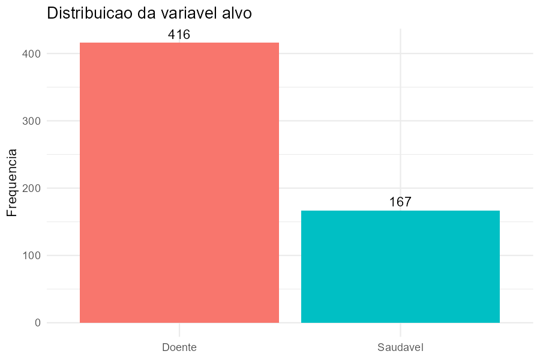

Dos 583 registros originais, **416 são doentes (71,4%)** e **167 saudáveis (28,6%)** — razão de 2,5 : 1. Isso tem duas consequências diretas:

- Um classificador trivial que rotulasse todo mundo como "doente" já atingiria 71% de acurácia. Por isso a **acurácia simples não é a métrica principal** deste projeto.
- Sem tratamento, os modelos tenderiam a favorecer a classe majoritária. Daí o uso de SMOTE (Seção 7.2).

#### Distribuição dos exames por classe

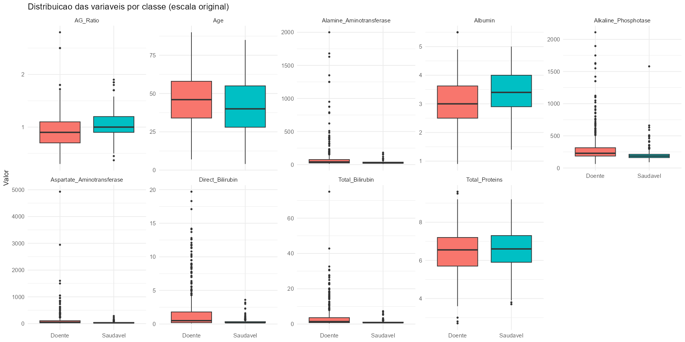

Os boxplots já revelam, antes de qualquer modelo, quais exames separam os grupos:

| Exame | Média doentes | Média saudáveis | p-valor (Welch) | Leitura |
|---|---|---|---|---|
| Total_Bilirubin | 4,16 | 1,14 | < 10⁻¹⁵ | ~3,6× maior nos doentes |
| Direct_Bilirubin | 1,92 | 0,40 | < 10⁻¹⁸ | ~4,9× maior nos doentes |
| Alamine_Aminotransferase (ALT) | 99,6 | 33,7 | < 10⁻⁸ | ~3× maior |
| Aspartate_Aminotransferase (AST) | 137,7 | 40,7 | < 10⁻⁷ | ~3,4× maior |
| Alkaline_Phosphotase | 319,0 | 219,8 | < 10⁻⁷ | ~1,5× maior |
| Albumin | 3,06 | 3,34 | < 10⁻⁴ | **menor** nos doentes |
| AG_Ratio | 0,91 | 1,03 | < 10⁻⁴ | **menor** nos doentes |
| Age | 46,2 | 41,2 | 0,001 | doentes ~5 anos mais velhos |
| Total_Proteins | 6,46 | 6,54 | 0,39 | **não significativo** |

Nove das dez variáveis apresentam diferença estatisticamente significativa entre as classes. `Total_Proteins` é a exceção — o que torna interessante o fato de ela aparecer como a **2ª variável mais importante no SHAP** (Seção 7.5): o modelo a usa em **interação** com outras variáveis, algo que um teste univariado não captura.

Os boxplots também expõem o problema de **assimetria extrema**: em ALT, AST e bilirrubinas a caixa fica achatada na base do gráfico e os outliers se estendem até dezenas de vezes a mediana. A transformação `log1p` reduziu a assimetria de AST de **10,5 → 1,24** e de ALT de **6,66 → 1,46**.

#### Correlação entre exames

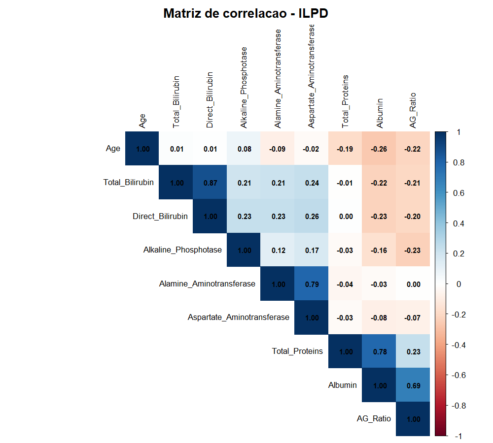

Três pares ultrapassam |r| > 0,7:

- `Total_Bilirubin` × `Direct_Bilirubin` = **0,874** — a bilirrubina direta é um componente da total.
- `Alamine_Aminotransferase` × `Aspartate_Aminotransferase` = **0,792** — ambas são transaminases liberadas na lesão do hepatócito.
- `Total_Proteins` × `Albumin` = **0,783** — albumina é a principal proteína plasmática.

Essa multicolinearidade explica por que, na regressão logística (Seção 7.3), `Total_Bilirubin` e `AST` **não** aparecem como significativas apesar de discriminarem fortemente as classes: seus efeitos são "absorvidos" pelas variáveis correlacionadas `Direct_Bilirubin` e `ALT`. Modelos de árvore são imunes a esse problema, mas o SHAP também redistribui a importância entre variáveis correlacionadas.

### 7.2 Balanceamento com SMOTE

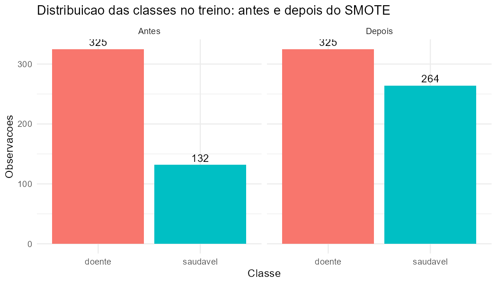

Após remover 13 duplicatas e separar o teste, o treino tinha 457 observações (**325 doentes / 132 saudáveis**, razão 2,46 : 1). O SMOTE com `dup_size = 0` gerou **132 amostras sintéticas** — dobrando a classe minoritária — e resultou em **589 observações (325 doentes / 264 saudáveis, razão 1,23 : 1)**.

Note que o balanceamento **não é perfeito** (55% / 45%). Essa foi uma escolha deliberada: com `dup_size = 0` o `smotefamily` gera o menor número inteiro de cópias sintéticas que aproxima as classes, evitando inflar demais o treino com dados artificiais. A verificação de integridade no log confirma que as médias das amostras sintéticas ficaram próximas às da classe minoritária original.

> **Nota metodológica:** o gráfico mostra apenas o **treino**. O conjunto de teste (113 pacientes, 71,7% doentes) nunca foi tocado pelo SMOTE. Isso é o que garante que as métricas da Seção 7.4 reflitam o desempenho na distribuição real.

### 7.3 Treinamento e validação cruzada

#### Desempenho na CV (5 folds × 3 repetições = 15 estimativas por modelo)

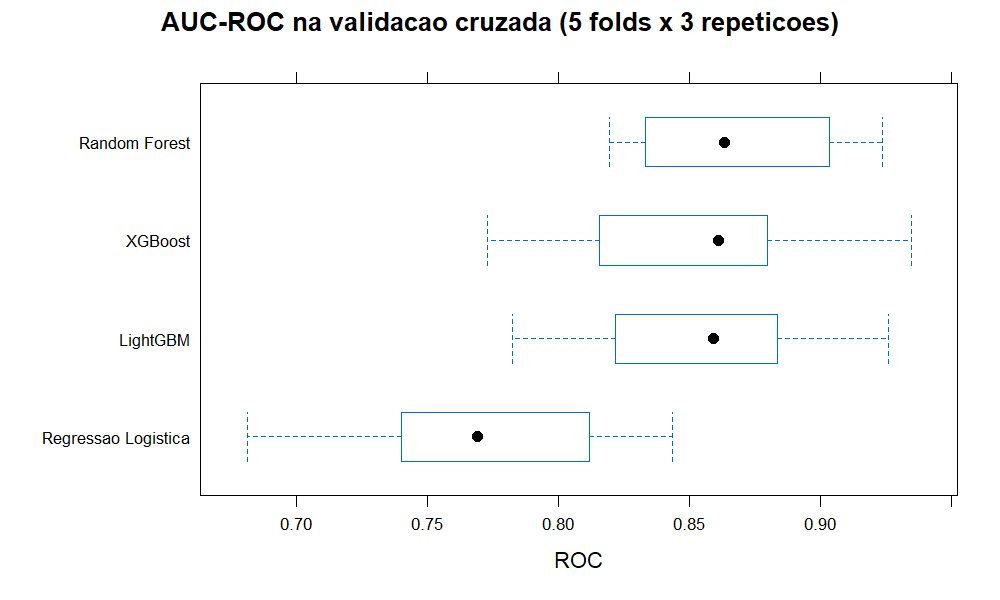

| Modelo | AUC média | DP | AUC mín | AUC máx |
|---|---|---|---|---|
| **Random Forest** | **0,865** | 0,037 | 0,819 | 0,924 |
| LightGBM | 0,854 | — | 0,783 | 0,926 |
| XGBoost | 0,851 | — | 0,773 | 0,935 |
| Regressão Logística | 0,774 | — | 0,681 | 0,844 |

O boxplot deixa visível o que a tabela resume:

- Os **três modelos de árvore formam um bloco** entre 0,85 e 0,87, com caixas sobrepostas.
- A **regressão logística fica claramente abaixo** — sua caixa inteira está à esquerda do mínimo do Random Forest.
- O Random Forest tem o **menor espalhamento** (bigodes mais curtos), ou seja, é o mais **estável** entre folds — desejável em um dataset pequeno.
- XGBoost tem o maior máximo (0,935) mas também um dos menores mínimos (0,773): mais variância.

#### Teste t pareado entre modelos (correção de Bonferroni)

Como os 4 modelos foram avaliados **nos mesmos 15 folds**, é possível testar se as diferenças são reais ou ruído:

| Comparação | Δ AUC | p-valor ajustado | Significativo? |
|---|---|---|---|
| RF vs Regressão Logística | +0,091 | 2,6 × 10⁻⁸ | **sim** |
| XGBoost vs Regressão Logística | +0,077 | 6,4 × 10⁻⁷ | **sim** |
| LightGBM vs Regressão Logística | +0,080 | 5,8 × 10⁻⁷ | **sim** |
| RF vs XGBoost | +0,014 | 0,032 | sim (marginal) |
| RF vs LightGBM | +0,012 | 0,184 | não |
| XGBoost vs LightGBM | −0,003 | 1,000 | não |

**Conclusão da CV:** todos os modelos de árvore são significativamente melhores que a regressão logística. Entre os modelos de árvore, o Random Forest tem vantagem marginal sobre o XGBoost, e XGBoost e LightGBM são estatisticamente indistinguíveis — o esperado, pois ambos são implementações de gradient boosting.

#### Hiperparâmetros selecionados

| Modelo | Melhor configuração | Comentário |
|---|---|---|
| Random Forest | `mtry = 2`, 500 árvores | Poucas variáveis por split → árvores mais diversas; consistente com a multicolinearidade dos exames |
| XGBoost | `nrounds = 200`, `max_depth = 5`, `eta = 0.3`, `colsample_bytree = 0.8`, `gamma = 0`, `min_child_weight = 1` | Árvores moderadamente profundas; taxa de aprendizado alta compensada por poucas rodadas |
| LightGBM | `num_leaves = 15`, `learning_rate = 0.1`, `nrounds = 300`, `feature_fraction = 0.7` | Configuração mais regularizada (menos folhas, subamostragem de 70% das variáveis) |

#### Coeficientes da regressão logística

Como as variáveis estão padronizadas, cada coeficiente representa o efeito de **+1 desvio-padrão** na variável sobre o log-odds de doença:

| Variável | Coeficiente | Odds Ratio | p-valor | Interpretação |
|---|---|---|---|---|
| Total_Proteins | +1,94 | **6,95** | < 0,001 | +1 DP multiplica a chance de doença por ~7 |
| AG_Ratio | +1,27 | 3,55 | 0,003 | efeito positivo (surpreendente — ver abaixo) |
| Alamine_Aminotransferase | +0,66 | 1,94 | 0,003 | ALT alta ≈ dobra a chance |
| Alkaline_Phosphotase | +0,43 | 1,53 | 0,004 | |
| Age | +0,32 | 1,37 | 0,002 | cada DP (~16 anos) aumenta 37% |
| Gender (masculino) | −0,21 | 0,81 | 0,034 | homens têm chance ~19% menor, ajustado pelos exames |
| **Albumin** | **−2,72** | **0,066** | < 0,001 | +1 DP reduz a chance em ~93% — o efeito protetor mais forte |
| Direct_Bilirubin | +0,59 | 1,81 | 0,33 | não significativo (colinear com Total_Bilirubin) |
| Total_Bilirubin | +0,09 | 1,09 | 0,88 | não significativo |
| Aspartate_Aminotransferase | +0,14 | 1,15 | 0,50 | não significativo (colinear com ALT) |

Dois pontos merecem discussão no texto do TCC:

1. **`Total_Proteins` e `Albumin` com sinais opostos e magnitudes enormes.** Como as duas têm r = 0,78, o modelo está efetivamente usando a *diferença* entre elas — que é aproximadamente a **globulina**. Globulina alta com albumina baixa é o padrão clássico de doença hepática crônica. A regressão logística "descobriu" isso sozinha.
2. **`AG_Ratio` com OR > 1** contradiz o teste univariado (doentes têm AG_Ratio *menor*). É um efeito de supressão: uma vez controlado por albumina e proteínas totais, o coeficiente muda de sinal. Isso ilustra por que coeficientes de regressão múltipla **não** devem ser interpretados isoladamente quando há multicolinearidade.

### 7.4 Avaliação no conjunto de teste

#### Curvas ROC

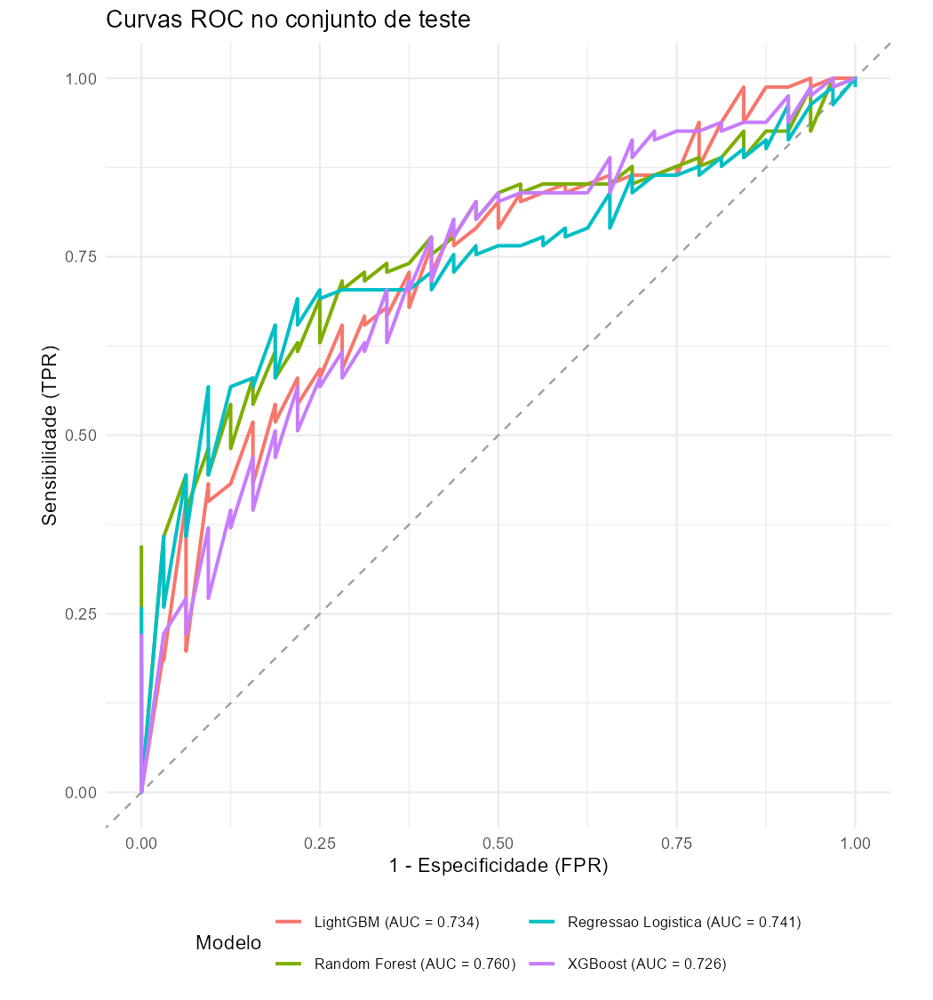

| Modelo | AUC | IC 95% (DeLong) | Sensibilidade | Especificidade | Precisão | F1 | Acur. bal. | Kappa |
|---|---|---|---|---|---|---|---|---|
| **Random Forest** | **0,760** | [0,671 ; 0,849] | 0,815 | 0,531 | 0,815 | 0,815 | 0,673 | 0,346 |
| Regressão Logística | 0,741 | [0,649 ; 0,832] | 0,741 | 0,563 | 0,811 | 0,774 | 0,652 | 0,284 |
| LightGBM | 0,734 | [0,636 ; 0,832] | 0,790 | 0,500 | 0,800 | 0,795 | 0,645 | 0,287 |
| XGBoost | 0,726 | [0,625 ; 0,827] | 0,815 | 0,531 | 0,815 | 0,815 | 0,673 | 0,346 |

Lendo o gráfico:

- As quatro curvas estão **claramente acima da diagonal** (classificador aleatório), mas **entrelaçadas** — nenhuma domina as outras em toda a extensão.
- Na região de **baixa taxa de falsos positivos** (FPR < 0,25, canto inferior esquerdo), **Random Forest e Regressão Logística** sobem mais rápido: são melhores quando se exige alta especificidade.
- Na região de **alta sensibilidade** (TPR > 0,85), **XGBoost e LightGBM** ficam ligeiramente acima: capturam os últimos doentes com menos falsos positivos.
- As curvas são "serrilhadas" porque há apenas 113 pacientes no teste — cada degrau é um paciente.

#### Matrizes de confusão (limiar 0,5)

| | Random Forest | XGBoost | LightGBM | Reg. Logística |
|---|---|---|---|---|
| **Verdadeiros positivos** (doente → doente) | 66 | 66 | 64 | 60 |
| **Falsos negativos** (doente → saudável) ⚠️ | 15 | 15 | 17 | 21 |
| **Falsos positivos** (saudável → doente) | 15 | 15 | 16 | 14 |
| **Verdadeiros negativos** (saudável → saudável) | 17 | 17 | 16 | 18 |

RF e XGBoost produzem **exatamente a mesma matriz de confusão** no limiar 0,5 (por isso têm F1, Kappa e acurácia idênticos), embora suas probabilidades — e portanto as AUCs — sejam diferentes. Dos 81 doentes no teste, os melhores modelos deixam passar **15 (18,5%)**; a regressão logística deixa passar 21 (26%).

#### Comparação estatística das AUCs (teste de DeLong)

| Comparação | AUC A | AUC B | p-valor |
|---|---|---|---|
| RF vs XGBoost | 0,760 | 0,726 | 0,193 |
| RF vs LightGBM | 0,760 | 0,734 | 0,249 |
| RF vs Reg. Logística | 0,760 | 0,741 | 0,559 |
| XGBoost vs LightGBM | 0,726 | 0,734 | 0,694 |
| Reg. Logística vs XGBoost | 0,741 | 0,726 | 0,736 |
| Reg. Logística vs LightGBM | 0,741 | 0,734 | 0,863 |

**Nenhuma diferença é significativa no teste.** Isso contrasta com a CV, onde os modelos de árvore venceram a regressão logística com p < 10⁻⁶. Duas explicações complementares:

1. **Poder estatístico.** A CV tem 15 estimativas pareadas sobre 589 observações; o teste tem 113 pacientes. Os intervalos de confiança das AUCs no teste têm largura de ~0,18 — maior que qualquer diferença observada.
2. **Efeito do SMOTE.** A CV foi feita sobre dados balanceados artificialmente. Modelos de árvore são flexíveis e podem ter se ajustado à estrutura das amostras sintéticas (interpolações lineares entre vizinhos), estrutura que não existe nos pacientes reais do teste. A regressão logística, mais rígida, sofre menos com isso — o que explica por que ela **cai apenas 0,033 de AUC** entre CV e teste (0,774 → 0,741), enquanto o Random Forest **cai 0,105** (0,865 → 0,760) e o XGBoost **cai 0,125** (0,851 → 0,726).

Este último ponto é um dos achados mais relevantes do trabalho: **o ranking da validação cruzada com SMOTE superestima a vantagem dos modelos complexos**.

#### Curvas Precision-Recall

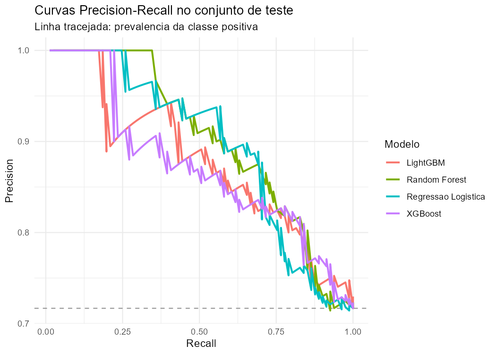

A linha tracejada horizontal em **0,717** é a prevalência de doentes no teste — a precisão que um classificador aleatório obteria. Todas as curvas ficam acima dela, mas note que, à medida que o recall se aproxima de 1,0 (capturar todos os doentes), a precisão converge para a prevalência: para não deixar nenhum doente passar, é preciso aceitar rotular quase todos os saudáveis como doentes.

#### Visão consolidada das métricas

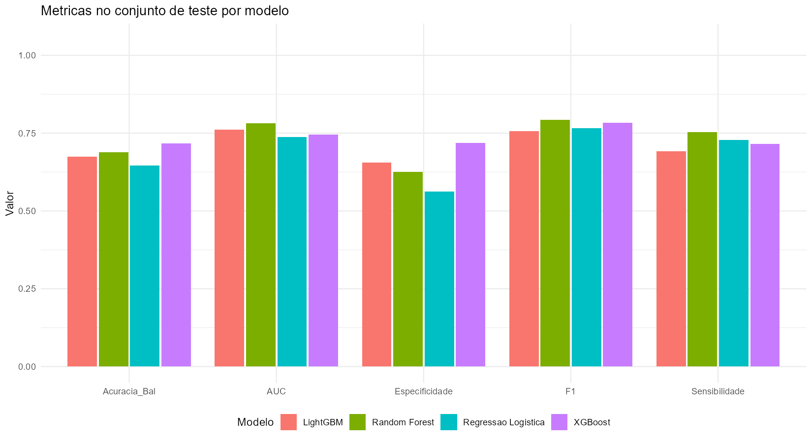

O gráfico de barras reforça o padrão: **sensibilidade alta (0,74–0,82) e especificidade baixa (0,50–0,56)** em todos os modelos. Isso significa que os modelos são bons em **confirmar doença** mas ruins em **descartá-la** — perfil típico de ferramenta de triagem, que deve ser seguida por exame confirmatório.

#### Análise do limiar de decisão (Random Forest)

O limiar 0,5 é uma convenção, não uma necessidade. Variando-o:

| Limiar | Sensibilidade | Especificidade | F1 | Cenário |
|---|---|---|---|---|
| 0,1 | 1,000 | 0,000 | 0,835 | rotula todos como doentes |
| 0,3 | 0,926 | 0,062 | 0,806 | |
| 0,4 | 0,877 | 0,312 | 0,816 | **triagem agressiva**: perde 10 doentes em 81 |
| **0,5** | 0,815 | 0,531 | 0,815 | padrão |
| 0,6 | 0,728 | 0,656 | 0,781 | |
| **0,636** | 0,691 | 0,750 | — | **índice de Youden** (equilíbrio Sens+Spec) |
| 0,7 | 0,617 | 0,812 | 0,730 | |
| 0,9 | 0,358 | 0,969 | 0,523 | **confirmação**: quase não erra ao dizer "doente" |

Em contexto de triagem, onde o custo de um falso negativo (doente não encaminhado) supera o de um falso positivo (exame adicional desnecessário), um limiar entre **0,4 e 0,5** é defensável. O limiar de Youden (0,636) só faz sentido se os dois erros tiverem o mesmo peso.

### 7.5 Explicabilidade (SHAP sobre o XGBoost)

#### Importância global

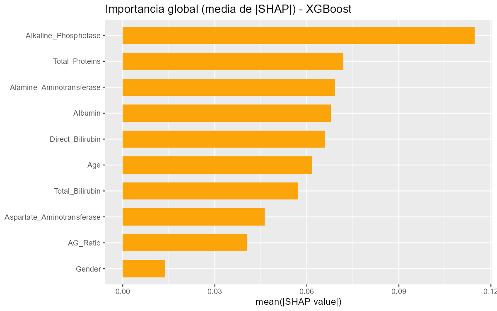

| # | Variável | Média |SHAP| | % do total | % acumulado |
|---|---|---|---|---|
| 1 | Alkaline_Phosphotase | 0,115 | 18,8% | 18,8% |
| 2 | Total_Proteins | 0,072 | 11,8% | 30,6% |
| 3 | Alamine_Aminotransferase | 0,069 | 11,4% | 42,0% |
| 4 | Albumin | 0,068 | 11,1% | 53,1% |
| 5 | Direct_Bilirubin | 0,066 | 10,8% | 63,9% |
| 6 | Age | 0,062 | 10,1% | 74,0% |
| 7 | Total_Bilirubin | 0,057 | 9,4% | 83,4% |
| 8 | Aspartate_Aminotransferase | 0,046 | 7,6% | 91,0% |
| 9 | AG_Ratio | 0,041 | 6,6% | 97,6% |
| 10 | Gender | 0,014 | 2,3% | 99,9% |

A **fosfatase alcalina** é isoladamente a variável mais importante (quase 19% do impacto total), e o modelo é relativamente **distribuído**: são necessárias **7 variáveis para acumular 80%** do impacto. Não há uma única "variável mágica" — coerente com um diagnóstico que depende de um painel de exames. `Gender` é praticamente irrelevante (2,3%).

#### Direção dos efeitos — beeswarm

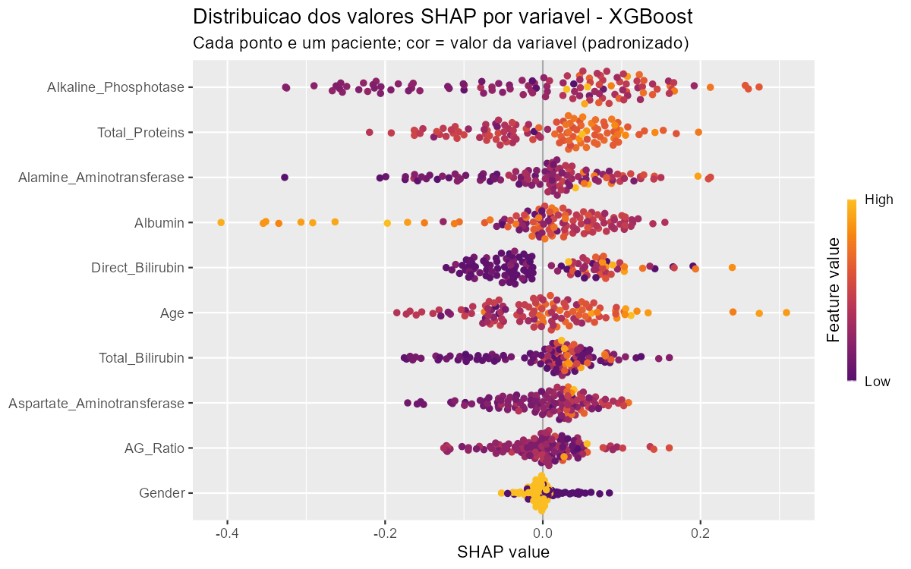

Este é o gráfico central da explicabilidade. Cada ponto é um dos 113 pacientes do teste; a posição horizontal é quanto aquela variável empurrou a previsão (direita = para "doente"), e a cor é o valor padronizado da variável (amarelo = alto, roxo = baixo).

Lendo linha a linha:

- **Alkaline_Phosphotase**: pontos amarelos/laranja à direita, roxos à esquerda. Valores altos aumentam o risco; valores baixos reduzem — e reduzem *muito* (cauda até −0,33). Efeito monotônico claro.
- **Total_Proteins**: pontos amarelos concentrados à direita. Proteínas totais altas → maior risco. Isso é o mesmo padrão "globulina" visto na regressão logística.
- **Albumin**: padrão **invertido** — pontos amarelos (albumina alta) espalhados à esquerda, alguns chegando a −0,40, o maior efeito protetor individual de todo o gráfico. Albumina alta é a evidência mais forte de fígado saudável que o modelo encontrou.
- **Direct_Bilirubin**: forma bimodal característica. Um aglomerado roxo denso à esquerda (bilirrubina direta baixa → protege) e um aglomerado vermelho/amarelo à direita (alta → risco). O modelo aprendeu essencialmente um **limiar** nessa variável.
- **Age**: pontos amarelos (mais velhos) à direita, com três outliers de idade muito avançada chegando a +0,30. Idade é fator de risco, com efeito acentuado nos extremos.
- **Gender**: coluna amarela (masculino) centrada em zero, pontos roxos (feminino) levemente à direita. Efeito quase nulo.

A tabela `results/shap_direcao_efeito.csv` quantifica isso pela correlação entre o valor da variável e seu SHAP:

| Variável | Correlação valor × SHAP | Efeito |
|---|---|---|
| Total_Proteins | +0,64 | ↑ valor → ↑ risco |
| Age | +0,64 | ↑ valor → ↑ risco |
| Direct_Bilirubin | +0,62 | ↑ valor → ↑ risco |
| Alamine_Aminotransferase | +0,60 | ↑ valor → ↑ risco |
| Alkaline_Phosphotase | +0,59 | ↑ valor → ↑ risco |
| Aspartate_Aminotransferase | +0,54 | ↑ valor → ↑ risco |
| Total_Bilirubin | +0,31 | ↑ valor → ↑ risco (mais fraco) |
| **Gender** | −0,56 | masculino → ↓ risco |
| **Albumin** | −0,51 | ↑ valor → ↓ risco |
| AG_Ratio | +0,19 | fraco / não monotônico |

**Coerência clínica:** fosfatase alcalina, transaminases e bilirrubinas elevadas são marcadores clássicos de colestase e lesão hepatocelular; albumina baixa reflete perda de função de síntese. O modelo, sem nenhum conhecimento médico, reproduziu o raciocínio de um hepatologista — forte indício de que está capturando sinal real e não artefatos.

#### Gráficos de dependência (4 variáveis mais importantes)

| | |
|---|---|
| 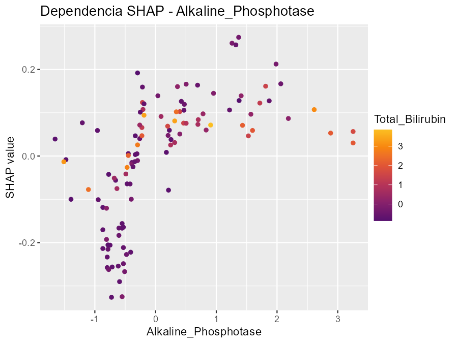 | 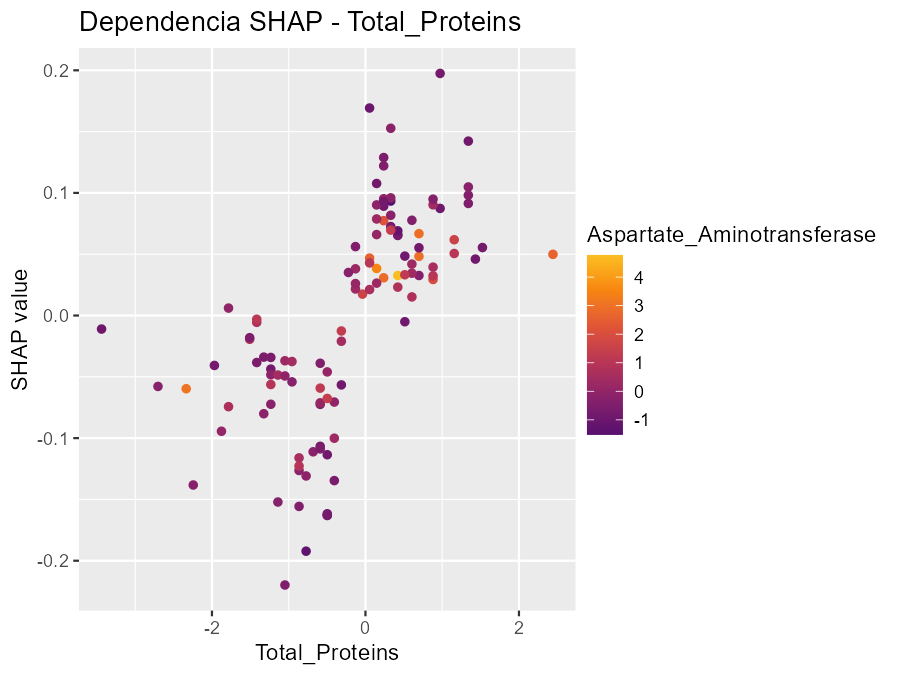 |
| 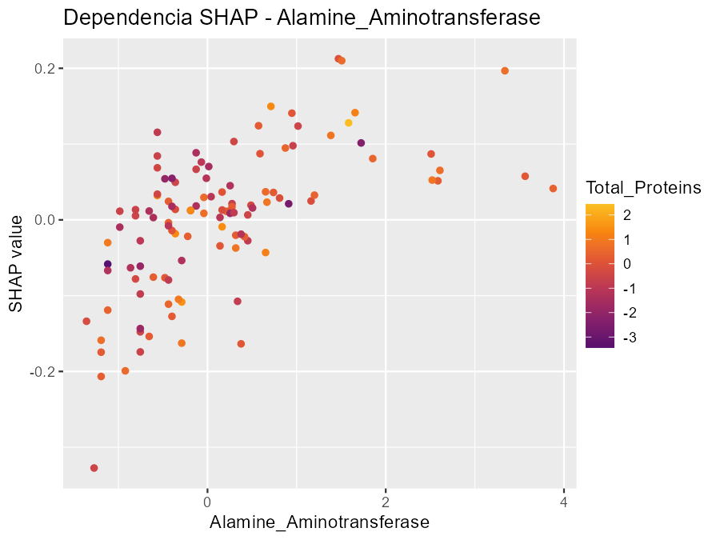 | 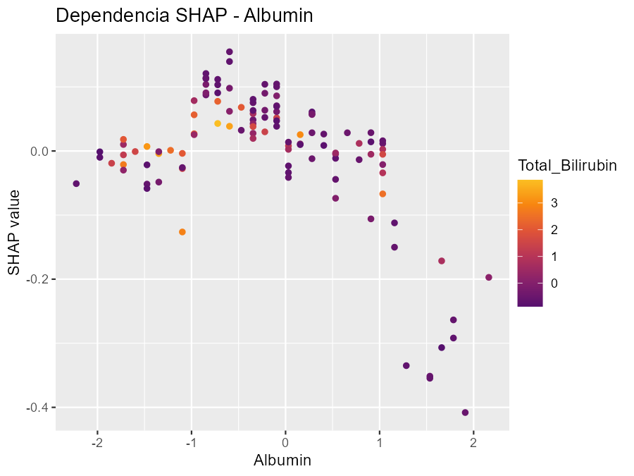 |

Os gráficos de dependência mostram a **forma funcional** da relação (eixo X = valor padronizado da variável, eixo Y = SHAP). Enquanto a regressão logística assume relação linear, os modelos de árvore podem aprender curvas — e o SHAP as revela. A cor indica a variável com maior **interação**: quando pontos com mesmo valor de X têm SHAP diferente dependendo da cor, o efeito daquela variável depende de outra.

#### Explicações locais — pacientes individuais

| Verdadeiro positivo mais confiante | Verdadeiro negativo mais confiante |
|---|---|
| 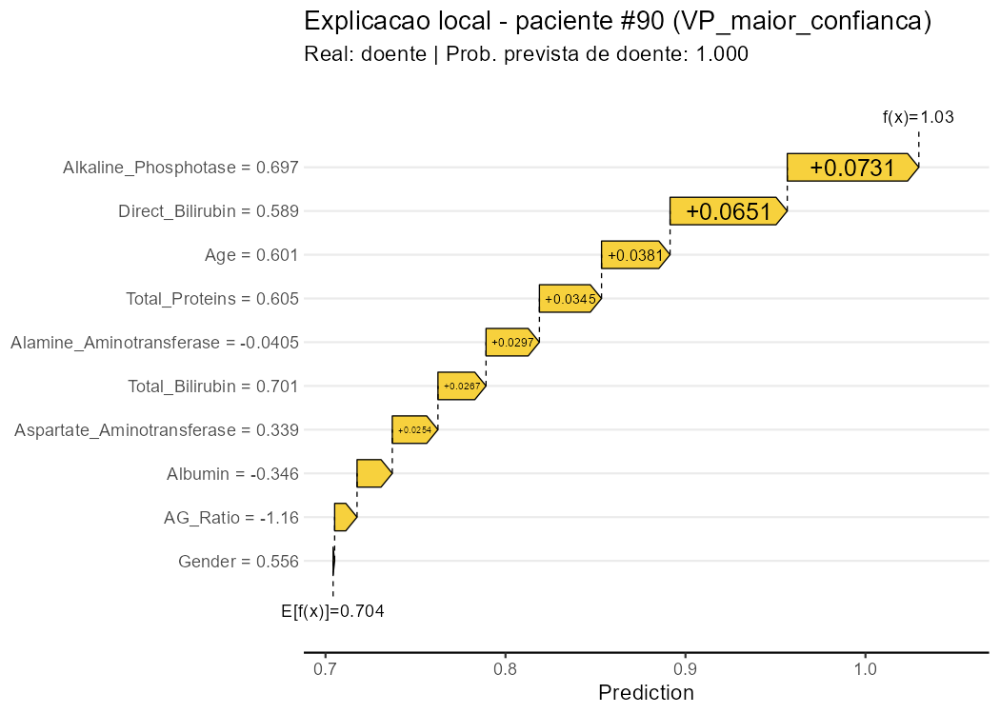 | 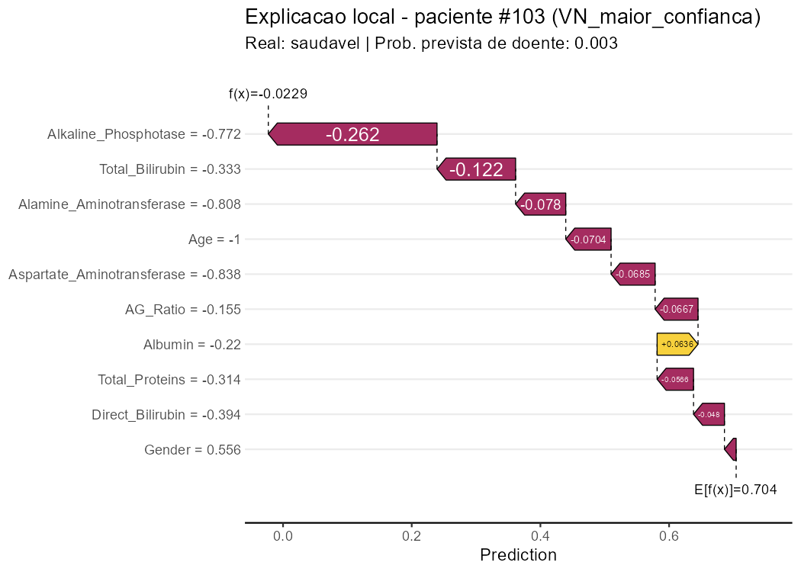 |

**Paciente #90 (doente, prob = 1,000):** o modelo tem certeza absoluta. A fosfatase alcalina elevada é a maior contribuição (+0,073) e praticamente todas as variáveis apontam na mesma direção.

**Paciente #103 (saudável, prob = 0,003):** a fosfatase alcalina *baixa* é a evidência decisiva (−0,262), puxando a previsão para longe do valor base de 0,704. Curiosamente a albumina contribui *a favor* de doença (+0,064) — mas é sobrepujada pelas demais.

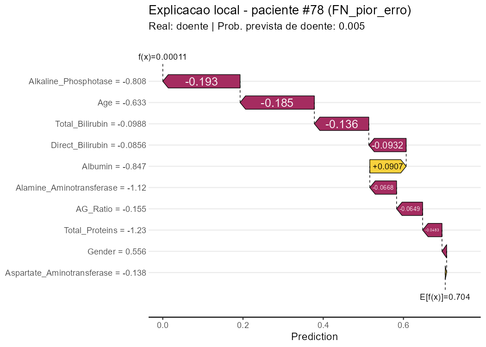

**Paciente #78 — o caso mais importante para análise crítica.** É um paciente **realmente doente** ao qual o modelo atribuiu apenas **0,5% de probabilidade de doença**. O waterfall mostra por quê: partindo do valor base E[f(x)] = 0,704, **quase todas as variáveis puxam para "saudável"**:

- Fosfatase alcalina baixa (−0,808 DP): −0,193
- Idade baixa (−0,633 DP): −0,185
- Bilirrubina total baixa: −0,136
- Bilirrubina direta baixa: −0,093
- ALT baixa (−1,12 DP): −0,067

Só a **albumina baixa (−0,847 DP)** aponta para doença (+0,091), mas é insuficiente. Em outras palavras: este paciente tem um **perfil laboratorial de pessoa saudável** — jovem, enzimas e bilirrubinas normais. Sua doença hepática não se manifesta nos exames incluídos no dataset (ou o rótulo está incorreto). Nenhum modelo baseado apenas nessas dez variáveis o classificaria corretamente. Esse tipo de análise é o que torna o SHAP útil na prática clínica: ele **distingue um erro do modelo de uma limitação dos dados**.

#### SHAP vs importância nativa dos outros modelos

| Variável | Rank SHAP (XGB) | Rank RF | Rank LightGBM |
|---|---|---|---|
| Alkaline_Phosphotase | **1** | **1** | **1** |
| Total_Proteins | 2 | 10 | 8 |
| Alamine_Aminotransferase | 3 | 4 | 4 |
| Albumin | 4 | 8 | 9 |
| Direct_Bilirubin | 5 | 5 | 5 |
| Age | 6 | 6 | 3 |
| Total_Bilirubin | 7 | 3 | 6 |
| Aspartate_Aminotransferase | 8 | 2 | 2 |
| AG_Ratio | 9 | 7 | 7 |
| Gender | 10 | 9 | 10 |

Correlação de Spearman entre rankings: SHAP × RF = **0,16**; SHAP × LightGBM = **0,32** — concordância baixa. Os três métodos concordam que **fosfatase alcalina é a variável #1** e que **gênero é irrelevante**, mas divergem no meio da tabela. A maior divergência é `Total_Proteins`: 2ª no SHAP, **última** no Random Forest. Isso é esperado — a importância nativa do RF (redução média de impureza) e do LightGBM (ganho) medem *quanto a variável foi útil para dividir nós*, enquanto o SHAP mede *quanto ela alterou a previsão final*. Variáveis fortemente correlacionadas (como `Total_Proteins` e `Albumin`) são especialmente afetadas: em árvores, uma "rouba" os splits da outra; no SHAP, o crédito é dividido de forma mais equilibrada. Essa é uma das razões pelas quais o SHAP é preferível como ferramenta de explicabilidade.

### 7.6 Síntese dos resultados

1. **Todos os modelos superam o acaso** (AUC 0,73–0,76 no teste; IC 95% não inclui 0,5), mas nenhum é excelente. O dataset é pequeno e o problema é genuinamente difícil.
2. **Random Forest é o modelo recomendado**: melhor AUC na CV (0,865) e no teste (0,760), menor variância entre folds, e apenas um hiperparâmetro.
3. **A regressão logística é competitiva no teste e é a mais robusta ao SMOTE** (menor queda CV → teste), além de fornecer odds ratios diretamente interpretáveis. Em contexto clínico, é uma alternativa séria.
4. **XGBoost e LightGBM são estatisticamente indistinguíveis** entre si em todas as análises.
5. **O perfil operacional é de triagem**: sensibilidade ~0,81, especificidade ~0,53. O limiar deve ser ajustado ao custo relativo dos erros.
6. **O SHAP confirma a plausibilidade clínica do modelo**: os marcadores que ele mais usa são os mesmos da literatura médica, com direções corretas.
7. **Os erros mais graves (falsos negativos) tendem a ser pacientes com exames normais** — uma limitação dos dados, não do algoritmo.

---

## 8. Explicabilidade — como interpretar os gráficos SHAP

### A ideia em uma frase

O SHAP decompõe a previsão de **cada paciente** em uma soma de contribuições, uma por variável:

```
probabilidade prevista = valor base (média) + SHAP(Age) + SHAP(Albumin) + ... + SHAP(Gender)
```

- **SHAP > 0** → aquela variável, para aquele paciente, empurrou a previsão na direção de **"doente"**.
- **SHAP < 0** → empurrou para **"saudável"**.
- Quanto maior o módulo, maior o impacto.

### `shap_importancia.png` — gráfico de barras

Média do |SHAP| de cada variável em todos os pacientes do teste. Barra maior = variável mais usada pelo modelo. **Não indica direção**, só magnitude.

### `shap_beeswarm.png` — "enxame de abelhas"

O gráfico mais informativo:

- **Cada linha** = uma variável (ordenada da mais para a menos importante).
- **Cada ponto** = um paciente do teste.
- **Posição horizontal** = valor SHAP (direita → mais risco de doença; esquerda → menos).
- **Cor** = valor da variável para aquele paciente (escala padronizada; cores quentes = alto, frias = baixo).

Como ler: se na linha de `Alkaline_Phosphotase` os pontos de cor quente (valor alto) estão à direita, então **fosfatase alcalina alta aumenta a probabilidade de doença**. Se em `Albumin` os pontos de cor quente estão à esquerda, **albumina alta protege**.

### `shap_dependencia_<variável>.png`

Eixo X = valor da variável; eixo Y = seu SHAP. Mostra a **forma** da relação: linear, com limiar, saturação, etc. A cor indica a variável com maior interação.

### `shap_waterfall_*.png` — explicação de um paciente

Começa no valor base (probabilidade média) e, barra a barra, mostra como cada variável somou ou subtraiu até chegar à previsão final daquele paciente. Três casos são gerados:

- `VP_maior_confianca`: doente que o modelo acertou com mais certeza — mostra o "perfil típico" de doença aprendido.
- `VN_maior_confianca`: saudável que o modelo acertou com mais certeza.
- `FN_pior_erro`: **doente que o modelo classificou como saudável com mais convicção** — o caso mais importante para análise crítica: quais exames "enganaram" o modelo?

---

## 9. Decisões metodológicas e justificativas

| Decisão | Alternativa descartada | Justificativa |
|---|---|---|
| Split **antes** do SMOTE e da normalização | Balancear/normalizar tudo e depois dividir | Evita vazamento de informação do teste para o treino |
| SMOTE em vez de undersampling | Remover pacientes da classe majoritária | Dataset pequeno (570); descartar dados piora a variância |
| `log1p` nas variáveis assimétricas | Manter escala original | Reduz influência de outliers extremos e melhora modelos lineares e o cálculo de vizinhos do SMOTE |
| CV repetida 5×3 | CV simples 10 folds | Repetição reduz a variância da estimativa; com 589 obs, 5 folds mantém folds de tamanho razoável |
| AUC como métrica de seleção | Acurácia | Acurácia é enganosa em dados desbalanceados (prever "doente" para todos daria 71%) |
| Teste de DeLong e t pareado | Comparar apenas médias | Diferenças de AUC de poucos centésimos podem ser ruído; testes estatísticos deixam isso explícito |
| SHAP em vez de só importância nativa | `varImp()` do caret | SHAP fornece direção do efeito, explicações locais e é consistente entre modelos |
| LightGBM via wrapper customizado no caret | Treinar fora do caret | Garante que o LightGBM use exatamente os mesmos folds e a mesma métrica dos outros modelos |
| Análise de limiar | Fixar 0,5 | Em triagem, o custo de FN ≠ custo de FP; o limiar é uma decisão clínica, não estatística |

---

## 10. Limitações e trabalhos futuros

**Limitações**

- Amostra pequena (113 pacientes de teste) → intervalos de confiança largos; nenhuma diferença entre modelos foi significativa.
- Dataset de uma única região geográfica — generalização para outras populações não é garantida.
- O rótulo "doente" agrupa diferentes patologias hepáticas.
- SMOTE gera amostras por interpolação linear, o que pode criar pacientes fisiologicamente implausíveis.
- Especificidade baixa (~0,5) em todos os modelos.

**Possíveis extensões**

- Validação cruzada aninhada (nested CV) para estimativa menos otimista do desempenho.
- Calibração de probabilidades (Platt scaling / isotônica) e curva de calibração.
- Engenharia de atributos com razões clínicas conhecidas (ex.: AST/ALT — razão de De Ritis).
- Ensemble (stacking) dos quatro modelos.
- Curvas de decisão (decision curve analysis) para avaliar utilidade clínica em vez de só desempenho estatístico.
- Validação externa em outro dataset hepático.

---

## 11. Referências

- Ramana, B. V., Babu, M. S. P., & Venkateswarlu, N. B. (2012). *ILPD (Indian Liver Patient Dataset)*. UCI Machine Learning Repository. https://archive.ics.uci.edu/dataset/225
- Chawla, N. V., Bowyer, K. W., Hall, L. O., & Kegelmeyer, W. P. (2002). SMOTE: Synthetic Minority Over-sampling Technique. *Journal of Artificial Intelligence Research*, 16, 321–357.
- Breiman, L. (2001). Random Forests. *Machine Learning*, 45(1), 5–32.
- Chen, T., & Guestrin, C. (2016). XGBoost: A Scalable Tree Boosting System. *KDD '16*.
- Ke, G. et al. (2017). LightGBM: A Highly Efficient Gradient Boosting Decision Tree. *NeurIPS 30*.
- Lundberg, S. M., & Lee, S.-I. (2017). A Unified Approach to Interpreting Model Predictions. *NeurIPS 30*.
- DeLong, E. R., DeLong, D. M., & Clarke-Pearson, D. L. (1988). Comparing the areas under two or more correlated ROC curves. *Biometrics*, 44(3), 837–845.
- Kuhn, M. (2008). Building Predictive Models in R Using the caret Package. *Journal of Statistical Software*, 28(5).
- Youden, W. J. (1950). Index for rating diagnostic tests. *Cancer*, 3(1), 32–35.
