# Classificação de Doença Hepática com Machine Learning e Explicabilidade (SHAP)

Pipeline completa em **R** para predição de doença hepática a partir de exames laboratoriais, usando o dataset **Indian Liver Patient Dataset (ILPD)**. O projeto compara quatro algoritmos de classificação com validação cruzada repetida, avalia-os em um conjunto de teste independente e explica as decisões do modelo com **valores SHAP**.

---

## Sumário

1. [Visão geral](#1-visão-geral)
2. [O problema](#2-o-problema)
3. [O dataset](#3-o-dataset)
4. [Estrutura do projeto](#4-estrutura-do-projeto)
5. [Como executar](#5-como-executar)
6. [Metodologia — etapa por etapa](#6-metodologia--etapa-por-etapa)
7. [Resultados obtidos](#7-resultados-obtidos)
8. [Explicabilidade — como interpretar os gráficos SHAP](#8-explicabilidade--como-interpretar-os-gráficos-shap)
9. [Decisões metodológicas e justificativas](#9-decisões-metodológicas-e-justificativas)
10. [Limitações e trabalhos futuros](#10-limitações-e-trabalhos-futuros)
11. [Referências](#11-referências)

---

## 1. Visão geral

```
CSV bruto ──► EDA ──► Pré-processamento (split 80/20 ──► imputação/normalização só no treino)
                                                │
                     Treino 4 modelos: CV 5x3 com SMOTE DENTRO de cada fold + Random Search
                                                │
   SHAP (XGB TreeSHAP, RF, melhor modelo) ◄── Avaliação no teste (métricas, limiar, por sexo) ◄──┘
```

| Item | Detalhe |
|---|---|
| Linguagem | R 4.5 |
| Framework de modelagem | `caret` (validação cruzada, tuning, comparação) |
| Modelos | Regressão Logística, Random Forest, XGBoost, LightGBM |
| Balanceamento | SMOTE **dentro de cada fold** da CV (via `trainControl(sampling = ...)`) |
| Busca de hiperparâmetros | **Random Search** (30 combinações por modelo) |
| Métrica de seleção | AUC-ROC; Recall analisado via limiar clínico (Sens ≥ 90 %) |
| Explicabilidade | SHAP: **TreeSHAP exato** (XGBoost/LightGBM) e `fastshap` (Random Forest), visualização com `shapviz` |
| Auditoria de viés | Métricas, ROC e SHAP **estratificados por sexo** |
| Reprodutibilidade | Seed global `42` em todas as etapas |
| Tempo total de execução | ≈ 8–10 min (dominado pelo tuning do XGBoost) |

---

## 2. O problema

Doenças hepáticas frequentemente são silenciosas nos estágios iniciais. Exames de sangue de rotina (bilirrubina, enzimas hepáticas, proteínas) carregam sinais que podem indicar comprometimento do fígado antes de sintomas clínicos.

**Objetivo:** dado um conjunto de exames laboratoriais + idade + sexo, prever se o paciente é **doente hepático (classe positiva)** ou **saudável**.

**Contexto clínico da métrica:** em triagem, o erro mais grave é o **falso negativo** (dizer que um doente está saudável). Por isso o projeto dá ênfase a **sensibilidade (recall)** e **AUC-ROC**, e não apenas à acurácia.

---

## 3. O dataset

**Indian Liver Patient Dataset (ILPD)** — UCI Machine Learning Repository.
583 pacientes coletados no nordeste de Andhra Pradesh, Índia.

| Variável | Descrição | Tipo |
|---|---|---|
| `Age` | Idade do paciente | numérica |
| `Gender` | Sexo (Male / Female) | categórica |
| `Total_Bilirubin` | Bilirrubina total (mg/dL) | numérica |
| `Direct_Bilirubin` | Bilirrubina direta (mg/dL) | numérica |
| `Alkaline_Phosphotase` | Fosfatase alcalina (IU/L) | numérica |
| `Alamine_Aminotransferase` | ALT / TGP (IU/L) | numérica |
| `Aspartate_Aminotransferase` | AST / TGO (IU/L) | numérica |
| `Total_Proteins` | Proteínas totais (g/dL) | numérica |
| `Albumin` | Albumina (g/dL) | numérica |
| `AG_Ratio` | Razão albumina/globulina | numérica |
| `Dataset` | **Alvo**: 1 = doente, 2 = saudável | binária |

Características relevantes descobertas na EDA:

- **Desbalanceamento**: ~71% doentes vs ~29% saudáveis (razão ≈ 2,5 : 1).
- **4 valores ausentes** em `AG_Ratio`.
- **13 linhas duplicadas**.
- **Forte assimetria** (skewness > 2) nas bilirrubinas e nas enzimas — típico de exames laboratoriais, onde poucos pacientes têm valores extremamente altos.
- **Alta correlação** entre `Total_Bilirubin` × `Direct_Bilirubin` e entre `ALT` × `AST` (esperado: medem processos fisiológicos relacionados).

---

## 4. Estrutura do projeto

```
workspace/
├── ExecutarTudo.R              # Orquestrador: roda tudo, cronometra e grava log
├── UtilsPipeline.R             # Log, persistência, SMOTE p/ caret (por fold) e wrapper LightGBM
├── 0.InstalarPacotes.R         # Verifica/instala dependências (versões fixadas)
├── 1.CarregamentoDeDados.R     # Leitura + análise exploratória (EDA)
├── 2.PreProcessamento.R        # Limpeza, encoding, log-transform, split, imputação e normalização (só treino)
├── 3.Balanceamento.R           # SMOTE no treino completo (diagnóstico e gráfico)
├── 4.Modelos.R                 # Treino dos 4 modelos: CV repetida + SMOTE por fold + Random Search
├── 5.Avaliacao.R               # Teste: métricas, ROC, PR, DeLong, limiar (todos), estratificação por sexo
├── 6.SHAP.R                    # Explicabilidade global, local e por sexo (XGB, RF e melhor modelo)
│
├── data/
│   ├── Indian Liver Patient Dataset (ILPD).csv   # dados brutos
│   ├── df_raw.rds              # dados carregados
│   ├── df_proc.rds             # treino pré-processado (distribuição real; entrada da etapa 4)
│   ├── df_balanceado.rds       # treino após SMOTE (apenas diagnóstico — etapa 3)
│   ├── teste.rds               # teste (nunca tocado pelo SMOTE)
│   ├── teste_genero.rds        # sexo dos pacientes do teste (rótulo legível, p/ estratificação)
│   └── preproc.rds             # parâmetros de normalização (média/DP do treino)
│
├── models/                     # modelos treinados (.rds, objetos caret)
│   ├── modelo_lr.rds
│   ├── modelo_rf.rds
│   ├── modelo_xgb.rds
│   └── modelo_lgb.rds
│
├── results/                    # tabelas em CSV prontas para o texto do TCC
│   ├── estatisticas_descritivas.csv
│   ├── comparacao_medias_por_classe.csv
│   ├── coeficientes_regressao_logistica.csv
│   ├── cv_auc_por_modelo.csv               # AUC, Sens e Spec médias na CV
│   ├── metricas_teste.csv                  # inclui limiar de Youden e limiar clínico (Sens ≥ 90 %)
│   ├── delong_pareado.csv
│   ├── melhor_modelo.rds                   # nome do melhor modelo (lido pela etapa 6)
│   ├── analise_limiar_modelos.csv          # limiar 0,1–0,9 para TODOS os modelos
│   ├── metricas_por_sexo.csv               # AUC/Sens/Spec/FN por sexo e modelo
│   ├── gap_desempenho_sexo.csv             # diferença M − F e teste de DeLong entre sexos
│   ├── shap_importancia_<m>.csv            # m = xgb | rf | lgb
│   ├── shap_direcao_efeito_<m>.csv
│   ├── shap_importancia_por_sexo_<m>.csv
│   ├── comparacao_importancia_modelos.csv  # rankings SHAP × nativa × |coef. RL|
│   └── concordancia_rankings_spearman.csv
│
├── plots/                      # figuras (PNG, 150 dpi)
│   ├── eda_*.png               # exploração
│   ├── smote_antes_depois.png
│   ├── cv_comparacao_modelos.png
│   ├── roc_teste.png / precision_recall_teste.png / metricas_teste.png
│   ├── limiar_sens_spec_modelos.png        # trade-off Sens × Spec por limiar, 4 modelos
│   ├── metricas_por_sexo.png / roc_por_sexo.png
│   ├── shap_importancia_<m>.png / shap_beeswarm_<m>.png
│   ├── shap_dependencia_<m>_<var>.png
│   ├── shap_waterfall_<m>_<caso>.png
│   └── shap_importancia_por_sexo_<m>.png / shap_gender_por_sexo_<m>.png
│
└── logs/
    └── pipeline_<timestamp>.log   # cópia integral do console de cada execução
```

---

## 5. Como executar

### Pré-requisitos

- R ≥ 4.3 (testado em 4.5.0)
- Acesso à internet na primeira execução (instalação de pacotes)

### Execução completa

No RStudio / DataSpell, com o diretório de trabalho na raiz do projeto:

```r
source("ExecutarTudo.R")
```

Ou pelo terminal:

```bash
Rscript ExecutarTudo.R
```

O script:

1. Verifica e instala pacotes faltantes (`0.InstalarPacotes.R`).
2. Executa as etapas 1 → 6 em sequência.
3. Cronometra cada etapa.
4. Espelha **todo** o console em `logs/pipeline_<timestamp>.log`.
5. Interrompe com mensagem clara se alguma etapa falhar.

### Execução por etapa

Cada script é independente e pode ser rodado isoladamente, desde que os artefatos da etapa anterior existam em `data/` ou `models/`:

```r
source("5.Avaliacao.R")   # reavalia os modelos já treinados sem retreinar
source("6.SHAP.R")        # recalcula só a explicabilidade
```

### Versões fixadas (por quê)

| Pacote | Versão | Motivo |
|---|---|---|
| `xgboost` | 1.7.8.1 | Versões 2.x quebram a integração com `caret::train(method = "xgbTree")` |
| `fastshap` | 0.1.1 | Pacote arquivado no CRAN; instalado a partir do archive |

---

## 6. Metodologia — etapa por etapa

### Etapa 0 — Instalação de pacotes

Verifica cada dependência e instala apenas o que falta. Registra no log a versão do R, a plataforma e a seed global. Fixa `xgboost` e `fastshap` nas versões compatíveis.

### Etapa 1 — Carregamento e análise exploratória

- Leitura do CSV com nomes de colunas explícitos.
- Tipos das variáveis, contagem de `NA` e duplicatas.
- Distribuição da variável alvo e razão de desbalanceamento.
- Tabela cruzada sexo × classe.
- Estatísticas descritivas (média, DP, mín, mediana, máx, **assimetria**) → `results/estatisticas_descritivas.csv`.
- **Teste t de Welch** comparando a média de cada exame entre doentes e saudáveis → identifica quais variáveis já discriminam as classes univariadamente.
- Matriz de correlação de Pearson com alerta para pares com |r| > 0,7.
- Gráficos: distribuição do alvo, boxplots por classe, heatmap de correlação.

### Etapa 2 — Pré-processamento

| Passo | O que faz | Por quê |
|---|---|---|
| Remoção de duplicatas | 583 → 570 linhas | Duplicatas inflam artificialmente a confiança e podem vazar entre treino e teste |
| Encoding | `Gender`: Male=1, Female=0; `Dataset`: `"doente"` / `"saudavel"` | `caret` exige rótulos textuais válidos para calcular probabilidades |
| Transformação `log1p` | Bilirrubinas, fosfatase alcalina, ALT, AST | Reduz assimetria extrema; melhora modelos lineares e a estabilidade do SMOTE (transformação determinística, sem parâmetros estimados) |
| **Split estratificado 80/20** | 457 treino / 113 teste | Estratificação garante a mesma proporção de classes nos dois conjuntos (71,1% vs 71,7%) |
| Imputação | `AG_Ratio` ausente ← **mediana do treino** (1,00), aplicada a treino e teste | Feita **após** o split: o teste não influencia o valor imputado. Mediana é robusta a outliers; apenas 4 casos |
| Normalização (center + scale) | Ajustada **somente no treino**, aplicada ao teste | Evita **data leakage**: o teste não pode influenciar os parâmetros de escala |
| Sexo do teste | Salvo em `teste_genero.rds` com rótulo legível | Necessário para a análise estratificada por sexo (etapas 5 e 6) |

> **Ponto crítico:** o split é feito **antes** de qualquer passo que estime parâmetros a partir dos dados (imputação, normalização, SMOTE). Se fosse depois, informação dos pacientes do teste contaminaria o treino e as métricas ficariam otimistas.

### Etapa 3 — Balanceamento com SMOTE (diagnóstico)

- SMOTE (Synthetic Minority Over-sampling Technique) com `K = 5` vizinhos, via a mesma função `aplicar_smote()` usada na etapa 4.
- Aplicado ao treino completo apenas para **diagnóstico e visualização**: 457 → 589 observações (132 sintéticas).
- Verificação de integridade: compara as médias das amostras sintéticas com as da classe minoritária original.
- O arquivo `df_balanceado.rds` **não** é usado para treinar — ver etapa 4.

### Etapa 4 — Treinamento dos modelos

**Validação cruzada repetida: 5 folds × 3 repetições = 15 avaliações por combinação de hiperparâmetros.** A métrica de seleção é a **AUC-ROC**.

**SMOTE dentro de cada fold.** O `trainControl` recebe `sampling = smote_caret` (definido em `UtilsPipeline.R`). Em cada iteração da CV o SMOTE é aplicado **apenas à partição de treino do fold**; a partição de validação contém somente pacientes reais. Sem isso (SMOTE antes da CV), amostras sintéticas — interpolações de pacientes que também estão na validação — vazam entre as partições e inflam a AUC da CV. O ajuste final de cada modelo também aplica SMOTE ao treino completo.

**Random Search.** `trainControl(search = "random")` sorteia 30 combinações de hiperparâmetros por modelo (`tuneLength = 30`); o wrapper do LightGBM implementa o mesmo comportamento na sua função `grid`.

| Modelo | Tipo | Hiperparâmetros sorteados |
|---|---|---|
| **Regressão Logística** | Linear, interpretável (baseline) | — |
| **Random Forest** | Bagging de 500 árvores | `mtry` (1–10; apenas 10 valores distintos possíveis) |
| **XGBoost** | Gradient boosting | `nrounds`, `max_depth`, `eta`, `gamma`, `colsample_bytree`, `min_child_weight`, `subsample` |
| **LightGBM** | Gradient boosting (histogram-based) | `num_leaves`, `learning_rate` (log-uniforme), `nrounds`, `feature_fraction`, `min_data_in_leaf` |

O `caret` não possui método nativo para LightGBM, então `UtilsPipeline.R` define um **wrapper customizado** (`lightgbm_caret`) implementando as funções `fit`, `predict`, `prob`, `varImp` e `grid`. Isso permite que o LightGBM participe da mesma validação cruzada e da comparação via `resamples()`, em pé de igualdade com os demais.

Saídas adicionais:

- **Coeficientes e odds ratios** da regressão logística com p-valores → interpretação direta do efeito de cada exame.
- AUC, **sensibilidade** e especificidade médias na CV por modelo → `results/cv_auc_por_modelo.csv`.
- Boxplot da AUC nos 15 folds para cada modelo.
- **Teste t pareado com correção de Bonferroni** entre modelos (`diff(resamples)`): as diferenças de AUC são estatisticamente significativas?

### Etapa 5 — Avaliação no conjunto de teste

Para cada modelo:

- Matriz de confusão com VP / FP / FN / VN.
- Acurácia, acurácia balanceada, sensibilidade, especificidade, precisão, F1, Kappa, AUC.
- **Intervalo de confiança de 95% da AUC** pelo método de **DeLong**.
- **Limiar ótimo pelo índice de Youden** (maximiza Sens + Spec − 1).
- **Limiar clínico (foco em Recall)**: o maior limiar que ainda garante **Sens ≥ 90 %**, com a especificidade e a precisão resultantes — quantifica o custo de priorizar falsos negativos em cada modelo.

Comparação entre modelos:

- Tabela consolidada → `results/metricas_teste.csv`; o nome do melhor modelo (por AUC) é salvo em `results/melhor_modelo.rds` e lido pela etapa 6.
- **Teste de DeLong pareado** para todas as combinações de modelos.
- Curvas ROC sobrepostas, curvas Precision-Recall, gráfico de barras de métricas.
- **Análise de sensibilidade ao limiar** (0,1 a 0,9) para **todos** os modelos, com contagem de FN/FP → `results/analise_limiar_modelos.csv` e `plots/limiar_sens_spec_modelos.png`.

**Análise estratificada por sexo (auditoria de viés — Straw & Wu, 2022):**

- Prevalência de doença por sexo no teste.
- Para cada modelo e sexo: AUC com IC DeLong, sensibilidade, especificidade, F1, **taxa de falsos negativos** (limiar 0,5 e limiar clínico) → `results/metricas_por_sexo.csv`.
- **Gap Masculino − Feminino** em AUC/Sens/Spec e **teste de DeLong não pareado** entre as curvas ROC dos dois sexos → `results/gap_desempenho_sexo.csv`.
- Gráficos: `metricas_por_sexo.png` e `roc_por_sexo.png`.

### Etapa 6 — Explicabilidade com SHAP

Aplicada ao **XGBoost**, ao **Random Forest** e ao **melhor modelo do teste** (se for outro), sobre os 113 pacientes do teste:

| Modelo | Método | Escala dos valores SHAP |
|---|---|---|
| XGBoost | **TreeSHAP exato** (`predict(..., predcontrib = TRUE)`) | log-odds |
| LightGBM | **TreeSHAP exato** (`predcontrib` nativo) | log-odds |
| Random Forest | `fastshap` (Monte Carlo, `nsim = 100`) — RF não possui TreeSHAP nativo em R | probabilidade |

> O `caret::xgbTree` codifica internamente o **primeiro** nível (`saudavel`) como 1; a etapa 6 inverte o sinal das contribuições para que, em todos os modelos, **SHAP > 0 signifique "empurra para doente"**.

| Saída (`<m>` = `xgb`, `rf` ou `lgb`) | O que responde |
|---|---|
| `shap_importancia_<m>.png` + `.csv` | Quais variáveis mais pesam nas decisões, em média? |
| `shap_beeswarm_<m>.png` | Em qual direção cada variável empurra a previsão? |
| `shap_direcao_efeito_<m>.csv` | Correlação valor-da-variável × SHAP, com interpretação textual |
| `shap_dependencia_<m>_<var>.png` | Como o efeito muda conforme o valor da variável (4 mais importantes) |
| `shap_waterfall_<m>_*.png` | Por que o modelo decidiu assim para **um paciente específico**? Três casos: o verdadeiro positivo mais confiante, o verdadeiro negativo mais confiante e o **pior falso negativo** |
| `shap_importancia_por_sexo_<m>.png` + `.csv` | O modelo usa as variáveis de forma diferente para homens e mulheres? (ranking por sexo + Spearman) |
| `shap_gender_por_sexo_<m>.png` | Quanto a variável `Gender`, isoladamente, desloca a previsão de risco em cada sexo? |
| `comparacao_importancia_modelos.csv` | Rankings SHAP (XGB, RF) × importância nativa (RF, LightGBM) × \|coeficiente\| da regressão logística |
| `concordancia_rankings_spearman.csv` | Matriz de correlação de Spearman entre todos os rankings |

---

## 7. Resultados obtidos

> Valores da execução de referência (`logs/pipeline_20260912_224913.log`). Podem variar levemente entre máquinas por diferenças de paralelismo, mas a seed fixa (`42`) garante reprodutibilidade na mesma máquina. Todas as tabelas estão em `results/` e todas as figuras em `plots/`.

### 7.1 Análise exploratória

#### Desbalanceamento das classes


Dos 583 registros originais, **416 são doentes (71,4%)** e **167 saudáveis (28,6%)** — razão de 2,5 : 1. Isso tem duas consequências diretas:

- Um classificador trivial que rotulasse todo mundo como "doente" já atingiria 71% de acurácia. Por isso a **acurácia simples não é a métrica principal** deste projeto.
- Sem tratamento, os modelos tenderiam a favorecer a classe majoritária. Daí o uso de SMOTE (Seção 7.2).

#### Distribuição dos exames por classe


Os boxplots já revelam, antes de qualquer modelo, quais exames separam os grupos:

| Exame | Média doentes | Média saudáveis | p-valor (Welch) | Leitura |
|---|---|---|---|---|
| Total_Bilirubin | 4,16 | 1,14 | < 10⁻¹⁵ | ~3,6× maior nos doentes |
| Direct_Bilirubin | 1,92 | 0,40 | < 10⁻¹⁸ | ~4,9× maior nos doentes |
| Alamine_Aminotransferase (ALT) | 99,6 | 33,7 | < 10⁻⁸ | ~3× maior |
| Aspartate_Aminotransferase (AST) | 137,7 | 40,7 | < 10⁻⁷ | ~3,4× maior |
| Alkaline_Phosphotase | 319,0 | 219,8 | < 10⁻⁷ | ~1,5× maior |
| Albumin | 3,06 | 3,34 | < 10⁻⁴ | **menor** nos doentes |
| AG_Ratio | 0,91 | 1,03 | < 10⁻⁴ | **menor** nos doentes |
| Age | 46,2 | 41,2 | 0,001 | doentes ~5 anos mais velhos |
| Total_Proteins | 6,46 | 6,54 | 0,39 | **não significativo** |

Nove das dez variáveis apresentam diferença estatisticamente significativa entre as classes. `Total_Proteins` é a exceção — o que torna interessante o fato de ela aparecer entre as variáveis mais importantes no SHAP do XGBoost e com o maior odds ratio da regressão logística (Seções 7.3 e 7.5): os modelos a usam em **interação** com `Albumin`, algo que um teste univariado não captura.

Os boxplots também expõem o problema de **assimetria extrema**: em ALT, AST e bilirrubinas a caixa fica achatada na base do gráfico e os outliers se estendem até dezenas de vezes a mediana. A transformação `log1p` reduziu a assimetria de AST de **10,5 → 1,24** e de ALT de **6,66 → 1,46**.

#### Correlação entre exames


Três pares ultrapassam |r| > 0,7:

- `Total_Bilirubin` × `Direct_Bilirubin` = **0,874** — a bilirrubina direta é um componente da total.
- `Alamine_Aminotransferase` × `Aspartate_Aminotransferase` = **0,792** — ambas são transaminases liberadas na lesão do hepatócito.
- `Total_Proteins` × `Albumin` = **0,783** — albumina é a principal proteína plasmática.

Essa multicolinearidade explica por que, na regressão logística (Seção 7.3), `Total_Bilirubin` e `AST` **não** aparecem como significativas apesar de discriminarem fortemente as classes: seus efeitos são "absorvidos" pelas variáveis correlacionadas `Direct_Bilirubin` e `ALT`. Modelos de árvore são imunes a esse problema, mas o SHAP também redistribui a importância entre variáveis correlacionadas.

### 7.2 Balanceamento com SMOTE


Após remover 13 duplicatas e separar o teste, o treino tem 457 observações (**325 doentes / 132 saudáveis**, razão 2,46 : 1). Aplicado ao treino completo (etapa 3, diagnóstico), o SMOTE com `dup_size = 0` gera **132 amostras sintéticas** — dobrando a classe minoritária — e resulta em **589 observações (325 doentes / 264 saudáveis, razão 1,23 : 1)**.

Note que o balanceamento **não é perfeito** (55% / 45%). Essa foi uma escolha deliberada: com `dup_size = 0` o `smotefamily` gera o menor número inteiro de cópias sintéticas que aproxima as classes, evitando inflar demais o treino com dados artificiais.

> **Nota metodológica:** este gráfico é apenas ilustrativo. No treino real (etapa 4) o SMOTE é reaplicado **dentro de cada um dos 15 folds**, somente à partição de treino do fold. As partições de validação e o conjunto de teste (113 pacientes, 71,7% doentes) contêm apenas pacientes reais.

### 7.3 Treinamento e validação cruzada

#### Desempenho na CV (5 folds × 3 repetições = 15 estimativas por modelo, SMOTE por fold)


| Modelo | AUC média | DP | AUC mín | AUC máx | Sens. média | Spec. média |
|---|---|---|---|---|---|---|
| **Regressão Logística** | **0,753** | 0,054 | 0,656 | 0,836 | **0,697** | 0,667 |
| XGBoost | 0,725 | 0,064 | 0,616 | 0,827 | 0,639 | 0,701 |
| Random Forest | 0,723 | 0,074 | 0,572 | 0,811 | 0,507 | 0,743 |
| LightGBM | 0,720 | 0,064 | 0,607 | 0,792 | 0,659 | 0,685 |

Com o SMOTE aplicado corretamente dentro de cada fold, o quadro muda em relação ao que se obtém com SMOTE *antes* da CV (onde os modelos de árvore atingiam AUC ≈ 0,85–0,87 e a regressão logística ≈ 0,77):

- **A regressão logística passa a ser o melhor modelo na CV**, e os três modelos de árvore formam um bloco em torno de 0,72, com caixas amplamente sobrepostas.
- A queda de ~0,13 de AUC nos modelos de árvore confirma que **o SMOTE antes da CV vaza informação**: as amostras sintéticas são interpolações de pacientes que também estão na partição de validação, e modelos flexíveis aprendem essa estrutura. A regressão logística, mais rígida, praticamente não se beneficiava do vazamento (0,774 → 0,753).
- O Random Forest tem a **menor sensibilidade na CV (0,51)** no limiar 0,5: com `mtry = 1` suas probabilidades ficam concentradas perto de 0,5 e o limiar padrão corta mal a classe positiva — reforçando a necessidade da análise de limiar (Seção 7.4).

#### Teste t pareado entre modelos (correção de Bonferroni)

| Comparação | Δ AUC | p-valor ajustado | Significativo? |
|---|---|---|---|
| Reg. Logística vs Random Forest | +0,030 | 0,060 | não (marginal) |
| Reg. Logística vs XGBoost | +0,028 | 0,007 | **sim** |
| Reg. Logística vs LightGBM | +0,033 | 0,008 | **sim** |
| Random Forest vs XGBoost | −0,001 | 1,000 | não |
| Random Forest vs LightGBM | +0,003 | 1,000 | não |
| XGBoost vs LightGBM | +0,004 | 1,000 | não |

**Conclusão da CV:** a regressão logística é estatisticamente superior ao XGBoost e ao LightGBM (p < 0,01) e marginalmente superior ao Random Forest. Os três modelos de árvore são indistinguíveis entre si. Em um dataset com 457 observações de treino e relações majoritariamente monotônicas entre exames e desfecho, a flexibilidade extra dos ensembles não compensa o custo em variância.

#### Hiperparâmetros selecionados (Random Search, 30 combinações)

| Modelo | Melhor configuração | Comentário |
|---|---|---|
| Random Forest | `mtry = 1`, 500 árvores | Uma única variável candidata por split → árvores máximamente descorrelacionadas; coerente com a forte multicolinearidade dos exames |
| XGBoost | `nrounds = 24`, `max_depth = 4`, `eta = 0,23`, `gamma = 7,3`, `colsample_bytree = 0,35`, `min_child_weight = 16`, `subsample = 0,49` | Configuração **fortemente regularizada** (poucas rodadas, `gamma` alto, 35 % das variáveis por árvore). Consequência: três variáveis nunca são usadas (ver Seção 7.5) |
| LightGBM | `num_leaves = 4`, `learning_rate = 0,012`, `nrounds = 200`, `feature_fraction = 0,57`, `min_data_in_leaf = 40` | Árvores rasas com aprendizado lento e folhas grandes — também regularizado |

O padrão é consistente: **a busca escolheu, para os três ensembles, as configurações mais simples do espaço**. É o comportamento esperado quando a CV é honesta e o sinal nos dados é essencialmente aditivo.

#### Coeficientes da regressão logística

Como as variáveis estão padronizadas, cada coeficiente representa o efeito de **+1 desvio-padrão** na variável sobre o log-odds de doença (modelo final ajustado no treino com SMOTE):

| Variável | Coeficiente | Odds Ratio | p-valor | Interpretação |
|---|---|---|---|---|
| Total_Proteins | +2,06 | **7,84** | < 0,001 | +1 DP multiplica a chance de doença por ~8 |
| AG_Ratio | +1,34 | 3,81 | 0,002 | efeito positivo (surpreendente — ver abaixo) |
| Alamine_Aminotransferase | +0,58 | 1,79 | 0,009 | ALT alta ≈ +79 % na chance |
| Alkaline_Phosphotase | +0,43 | 1,53 | 0,004 | |
| Age | +0,32 | 1,37 | 0,002 | cada DP (~16 anos) aumenta 37 % |
| Gender (masculino) | −0,21 | 0,81 | 0,036 | homens têm chance ~19 % menor, **ajustado pelos exames** |
| **Albumin** | **−2,85** | **0,058** | < 0,001 | +1 DP reduz a chance em ~94 % — o efeito protetor mais forte |
| Direct_Bilirubin | +0,38 | 1,46 | 0,52 | não significativo (colinear com Total_Bilirubin) |
| Total_Bilirubin | +0,28 | 1,32 | 0,65 | não significativo |
| Aspartate_Aminotransferase | +0,28 | 1,32 | 0,20 | não significativo (colinear com ALT) |

Dois pontos merecem discussão no texto do TCC:

1. **`Total_Proteins` e `Albumin` com sinais opostos e magnitudes enormes.** Como as duas têm r = 0,78, o modelo está efetivamente usando a *diferença* entre elas — que é aproximadamente a **globulina**. Globulina alta com albumina baixa é o padrão clássico de doença hepática crônica. A regressão logística "descobriu" isso sozinha.
2. **`AG_Ratio` com OR > 1** contradiz o teste univariado (doentes têm AG_Ratio *menor*). É um efeito de supressão: uma vez controlado por albumina e proteínas totais, o coeficiente muda de sinal. Isso ilustra por que coeficientes de regressão múltipla **não** devem ser interpretados isoladamente quando há multicolinearidade.
3. **`Gender` é significativo (p = 0,036) e protetor para homens.** Isso é o oposto da prevalência bruta (79 % dos homens do teste são doentes vs 53 % das mulheres): o modelo aprende que, *para o mesmo perfil laboratorial*, uma mulher tem risco ligeiramente maior. Esse é exatamente o tipo de efeito que a análise estratificada por sexo (Seção 7.4) precisa auditar.

### 7.4 Avaliação no conjunto de teste

#### Curvas ROC


| Modelo | AUC | IC 95% (DeLong) | Sensibilidade | Especificidade | Precisão | F1 | Acur. bal. | Kappa |
|---|---|---|---|---|---|---|---|---|
| **Random Forest** | **0,781** | [0,694 ; 0,868] | **0,753** | 0,625 | 0,836 | **0,792** | 0,689 | 0,352 |
| LightGBM | 0,761 | [0,671 ; 0,851] | 0,691 | 0,656 | 0,836 | 0,757 | 0,674 | 0,307 |
| XGBoost | 0,745 | [0,650 ; 0,840] | 0,716 | **0,719** | **0,866** | 0,784 | **0,717** | **0,384** |
| Regressão Logística | 0,737 | [0,644 ; 0,829] | 0,728 | 0,563 | 0,808 | 0,766 | 0,645 | 0,270 |

Lendo o gráfico:

- As quatro curvas estão **claramente acima da diagonal**, mas **entrelaçadas** — nenhuma domina as outras em toda a extensão. As curvas são "serrilhadas" porque há apenas 113 pacientes no teste.
- **No teste, o ranking se inverte em relação à CV**: o Random Forest, último na CV, tem a maior AUC; a regressão logística, primeira na CV, tem a menor. As diferenças, porém, estão todas dentro dos intervalos de confiança (largura ≈ 0,18) — o que a Seção seguinte formaliza.
- A comparação CV → teste é agora **coerente**: RL 0,753 → 0,737 (−0,016), XGBoost 0,725 → 0,745 (+0,020), RF 0,723 → 0,781 (+0,058), LightGBM 0,720 → 0,761 (+0,041). Nenhum modelo "despenca" no teste, sinal de que a CV com SMOTE por fold é uma estimativa honesta.

#### Matrizes de confusão (limiar 0,5)

| | Random Forest | XGBoost | LightGBM | Reg. Logística |
|---|---|---|---|---|
| **Verdadeiros positivos** (doente → doente) | 61 | 58 | 56 | 59 |
| **Falsos negativos** (doente → saudável) ⚠️ | 20 | 23 | 25 | 22 |
| **Falsos positivos** (saudável → doente) | 12 | 9 | 11 | 14 |
| **Verdadeiros negativos** (saudável → saudável) | 20 | 23 | 21 | 18 |

Dos 81 doentes no teste, o Random Forest deixa passar **20 (24,7 %)** no limiar padrão; o LightGBM, 25 (30,9 %). O XGBoost é o mais equilibrado (Sens ≈ Spec ≈ 0,72), refletindo sua forte regularização.

#### Comparação estatística das AUCs (teste de DeLong)

| Comparação | AUC A | AUC B | p-valor |
|---|---|---|---|
| Reg. Logística vs Random Forest | 0,737 | 0,781 | 0,159 |
| Random Forest vs XGBoost | 0,781 | 0,745 | 0,223 |
| Random Forest vs LightGBM | 0,781 | 0,761 | 0,360 |
| Reg. Logística vs LightGBM | 0,737 | 0,761 | 0,433 |
| XGBoost vs LightGBM | 0,745 | 0,761 | 0,556 |
| Reg. Logística vs XGBoost | 0,737 | 0,745 | 0,785 |

**Nenhuma diferença é significativa no teste.** Combinado com a CV (onde a única diferença significativa favorece a regressão logística), o resultado do trabalho é claro: **neste dataset, os modelos de caixa-preta não oferecem ganho preditivo demonstrável sobre o modelo linear interpretável.** Esse achado é central para o objetivo 6 da proposta (trade-off desempenho × interpretabilidade).

#### Curvas Precision-Recall


A linha tracejada horizontal em **0,717** é a prevalência de doentes no teste — a precisão que um classificador aleatório obteria. Todas as curvas ficam acima dela, mas, à medida que o recall se aproxima de 1,0, a precisão converge para a prevalência: para não deixar nenhum doente passar, é preciso aceitar rotular quase todos os saudáveis como doentes.

#### Visão consolidada das métricas


#### Foco em Recall: limiar clínico (Sens ≥ 90 %) e análise de limiar para todos os modelos

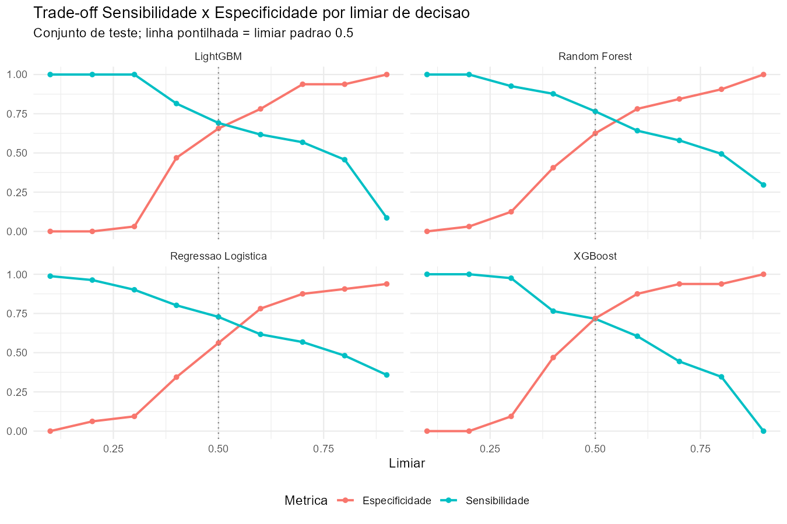

A proposta pede atenção especial ao Recall. Em vez de otimizar Recall diretamente (o que leva ao modelo trivial "todos doentes"), cada modelo foi avaliado no **maior limiar que ainda garante Sens ≥ 90 %** — isto é, no ponto em que no máximo 8 dos 81 doentes escapam:

| Modelo | Limiar clínico | Sensibilidade | Especificidade | Precisão | Limiar de Youden (Sens / Spec) |
|---|---|---|---|---|---|
| **Random Forest** | 0,369 | 0,901 | **0,313** | **0,768** | 0,572 (0,704 / 0,781) |
| LightGBM | 0,358 | 0,901 | 0,281 | 0,760 | 0,702 (0,568 / 0,938) |
| XGBoost | 0,342 | 0,901 | 0,188 | 0,737 | 0,512 (0,716 / 0,781) |
| Regressão Logística | 0,319 | 0,901 | 0,188 | 0,737 | 0,722 (0,568 / 0,906) |

Leitura:

- **Garantir 90 % de sensibilidade custa muita especificidade** em todos os modelos: o melhor (RF) ainda rotula 69 % dos saudáveis como doentes. Isso caracteriza os modelos como ferramentas de **triagem** (alta sensibilidade, seguida de exame confirmatório), não de diagnóstico.
- No regime de alta sensibilidade o Random Forest é o melhor: mesma sensibilidade com **10 falsos positivos a menos** (Spec 0,31 vs 0,19) que RL e XGBoost.
- A tabela completa por limiar (0,1 a 0,9, com contagem de FN e FP para cada modelo) está em `results/analise_limiar_modelos.csv`. Para o Random Forest, por exemplo: limiar 0,4 → Sens 0,877 / Spec 0,406 (10 FN, 19 FP); limiar 0,5 → 0,765 / 0,625 (19 FN, 12 FP); limiar 0,6 → 0,642 / 0,781 (29 FN, 7 FP).

#### Análise estratificada por sexo (auditoria de viés)

| | Curvas ROC por sexo |
|---|---|
| 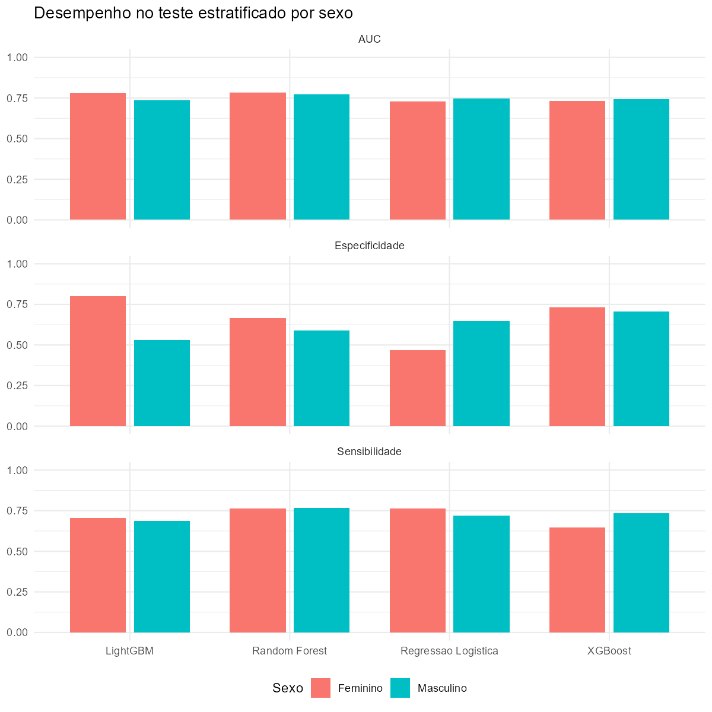 | 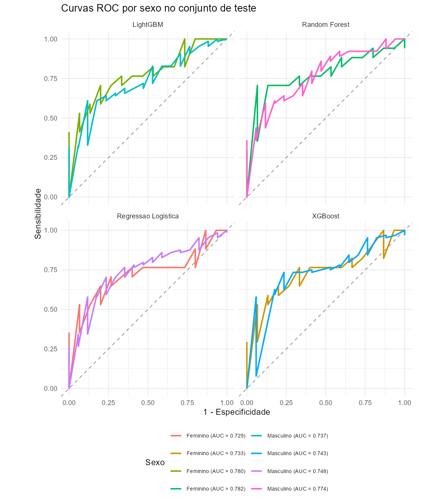 |

O teste tem **32 mulheres (17 doentes, 53 %)** e **81 homens (64 doentes, 79 %)**. Como a prevalência difere muito, uma métrica agregada pode esconder desempenho desigual.

| Modelo | AUC ♀ | AUC ♂ | Δ AUC (♂−♀) | p DeLong | Sens ♀ | Sens ♂ | Spec ♀ | Spec ♂ | Taxa FN ♀ | Taxa FN ♂ |
|---|---|---|---|---|---|---|---|---|---|---|
| Regressão Logística | 0,729 | 0,748 | +0,019 | 0,87 | 0,765 | 0,719 | 0,467 | 0,647 | 0,235 | 0,281 |
| **Random Forest** | 0,782 | 0,774 | −0,008 | 0,94 | 0,765 | 0,766 | 0,667 | 0,588 | 0,235 | 0,234 |
| XGBoost | 0,733 | 0,743 | +0,009 | 0,93 | **0,647** | 0,734 | 0,733 | 0,706 | **0,353** | 0,266 |
| LightGBM | 0,780 | 0,737 | −0,043 | 0,68 | 0,706 | 0,688 | 0,800 | 0,529 | 0,294 | 0,313 |

Leitura:

- **Nenhuma diferença de AUC entre sexos é significativa** (todos p > 0,6), e as AUCs por sexo estão sempre a menos de 0,05 uma da outra. Não há evidência de que os modelos discriminem pior em um dos grupos.
- **O Random Forest é o mais equânime**: sensibilidade praticamente idêntica (0,765 vs 0,766) e taxa de FN igual (≈ 23,5 %) nos dois sexos.
- **O XGBoost é o menos equânime em sensibilidade**: perde **35 % das mulheres doentes** contra 27 % dos homens doentes (Δ Sens = +0,087 a favor dos homens). Com 17 mulheres doentes, isso corresponde a 6 vs ~4,5 casos — a diferença não é significativa, mas é exatamente o padrão que Straw & Wu (2022) alertam: modelos treinados em populações majoritariamente masculinas (75 % dos pacientes do ILPD) podem ter falsos negativos concentrados nas mulheres.
- A **regressão logística e o LightGBM têm especificidade muito diferente entre sexos** (Δ = +0,18 e −0,27), ou seja, o mesmo limiar produz taxas de falso positivo distintas para homens e mulheres. Em um sistema real, isso sugere **calibrar o limiar por sexo**.

> **Cautela:** o grupo feminino tem apenas 32 pacientes; os ICs das AUCs femininas têm largura ≈ 0,35. Os gaps aqui são indicativos, não conclusivos.

### 7.5 Explicabilidade (SHAP)

Foram explicados o **XGBoost** (TreeSHAP exato, escala log-odds) e o **Random Forest** (melhor modelo no teste; `fastshap`, escala de probabilidade). Como as escalas diferem, comparam-se **rankings e direções**, não magnitudes.

#### Importância global

| | |
|---|---|
| 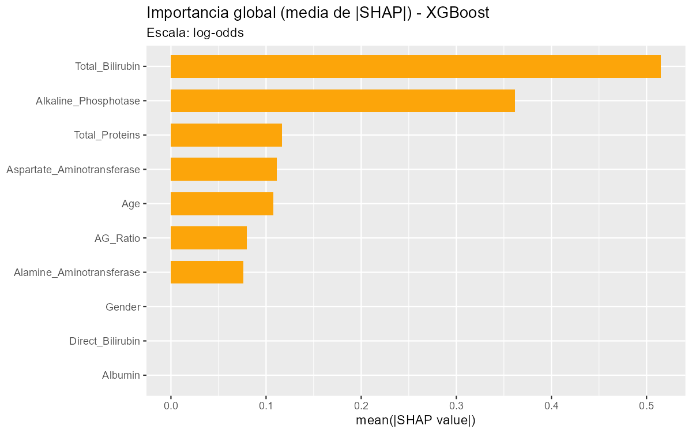 | 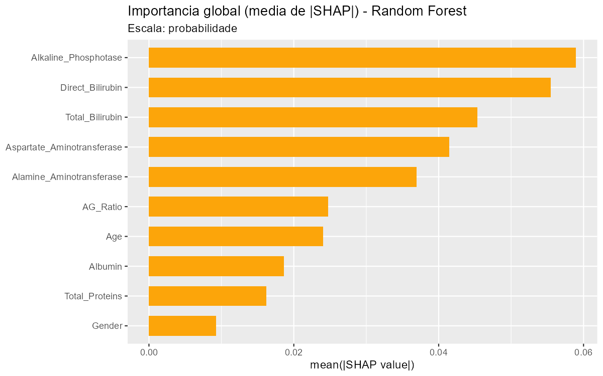 |

| # | XGBoost — variável | Média \|SHAP\| | % | Random Forest — variável | Média \|SHAP\| | % |
|---|---|---|---|---|---|---|
| 1 | Total_Bilirubin | 0,515 | 37,6 | Alkaline_Phosphotase | 0,059 | 17,8 |
| 2 | Alkaline_Phosphotase | 0,362 | 26,4 | Direct_Bilirubin | 0,056 | 16,8 |
| 3 | Total_Proteins | 0,117 | 8,5 | Total_Bilirubin | 0,045 | 13,7 |
| 4 | Aspartate_Aminotransferase | 0,111 | 8,1 | Aspartate_Aminotransferase | 0,041 | 12,5 |
| 5 | Age | 0,108 | 7,9 | Alamine_Aminotransferase | 0,037 | 11,2 |
| 6 | AG_Ratio | 0,080 | 5,8 | AG_Ratio | 0,025 | 7,5 |
| 7 | Alamine_Aminotransferase | 0,076 | 5,6 | Age | 0,024 | 7,3 |
| 8 | Gender | **0,000** | 0,0 | Albumin | 0,019 | 5,6 |
| 9 | Direct_Bilirubin | **0,000** | 0,0 | Total_Proteins | 0,016 | 4,9 |
| 10 | Albumin | **0,000** | 0,0 | Gender | 0,009 | 2,8 |

Dois perfis muito diferentes de "raciocínio":

- **XGBoost é concentrado**: bilirrubina total e fosfatase alcalina respondem por **64 %** do impacto; 4 variáveis acumulam 80 %. Com `colsample_bytree = 0,35` e `gamma = 7,3`, **três variáveis nunca entraram em nenhuma árvore** (`Gender`, `Direct_Bilirubin`, `Albumin`). O modelo descartou `Direct_Bilirubin` porque é redundante com `Total_Bilirubin` (r = 0,87) e `Albumin` porque é redundante com `Total_Proteins`/`AG_Ratio`.
- **Random Forest é distribuído**: a variável #1 tem só 17,8 % e são necessárias **7 variáveis para acumular 80 %**. Com `mtry = 1`, cada split é forçado a usar uma variável sorteada, então até variáveis redundantes recebem crédito.
- Ambos concordam que **`Gender` é (quase) irrelevante** — 0 % no XGBoost, 2,8 % no RF — e que **fosfatase alcalina, bilirrubinas e transaminases** dominam.

#### Direção dos efeitos — beeswarm

| XGBoost | Random Forest |
|---|---|
| 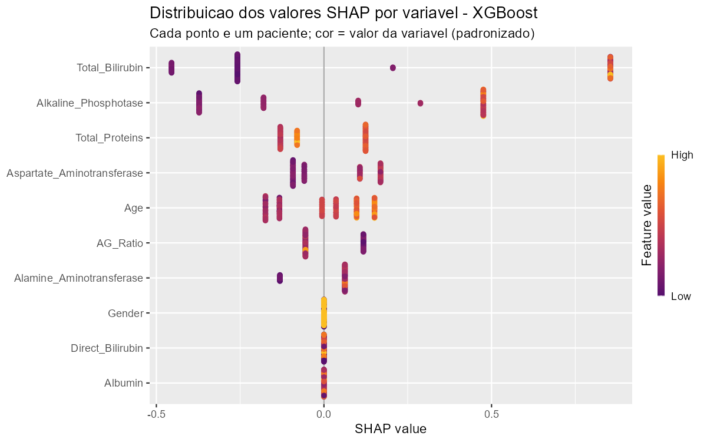 | 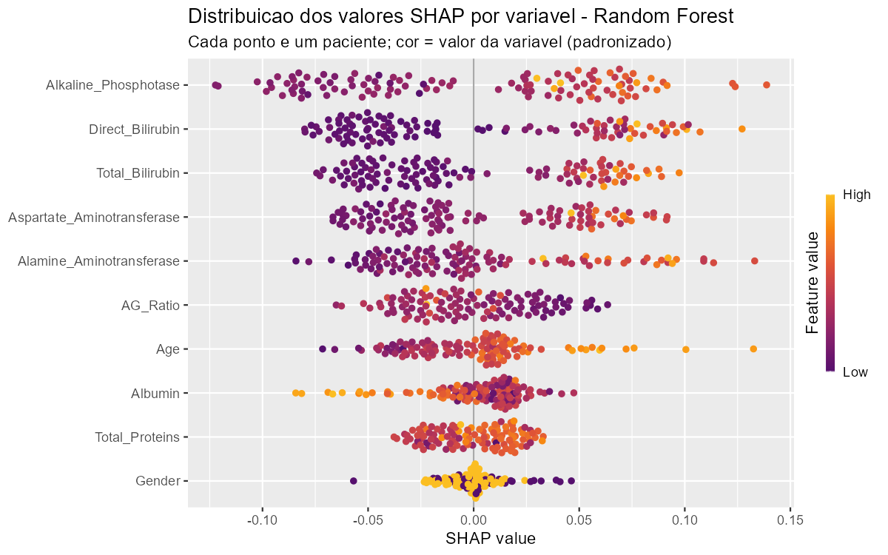 |

Cada ponto é um dos 113 pacientes do teste; a posição horizontal é quanto aquela variável empurrou a previsão (direita = para "doente"), e a cor é o valor padronizado da variável. As tabelas `results/shap_direcao_efeito_<m>.csv` quantificam a direção pela correlação entre o valor da variável e seu SHAP:

| Variável | Corr. XGBoost | Corr. Random Forest | Efeito |
|---|---|---|---|
| Age | +0,86 | +0,87 | ↑ idade → ↑ risco |
| Total_Bilirubin | +0,81 | +0,85 | ↑ → ↑ risco |
| Alkaline_Phosphotase | +0,81 | +0,77 | ↑ → ↑ risco |
| Aspartate_Aminotransferase | +0,72 | +0,83 | ↑ → ↑ risco |
| Alamine_Aminotransferase | +0,53 | +0,82 | ↑ → ↑ risco |
| Direct_Bilirubin | — (não usada) | +0,83 | ↑ → ↑ risco |
| Total_Proteins | +0,36 | +0,40 | ↑ → ↑ risco (fraco) |
| **Albumin** | — (não usada) | **−0,71** | ↑ albumina → ↓ risco |
| **AG_Ratio** | **−0,67** | **−0,58** | ↑ razão A/G → ↓ risco |
| Gender | — (não usada) | −0,17 | fraco |

**Coerência clínica:** os dois modelos, sem nenhum conhecimento médico, reproduzem o raciocínio de um hepatologista — bilirrubinas, fosfatase alcalina e transaminases elevadas indicam colestase e lesão hepatocelular; albumina e razão A/G altas refletem função de síntese preservada. Note que o SHAP recupera a **direção correta de `AG_Ratio`** (protetora), ao contrário do coeficiente da regressão logística (OR = 3,8), que é distorcido pela multicolinearidade. Esse é um argumento concreto a favor do SHAP como ferramenta de interpretação.

#### Gráficos de dependência (4 variáveis mais importantes de cada modelo)

| XGBoost | Random Forest |
|---|---|
| 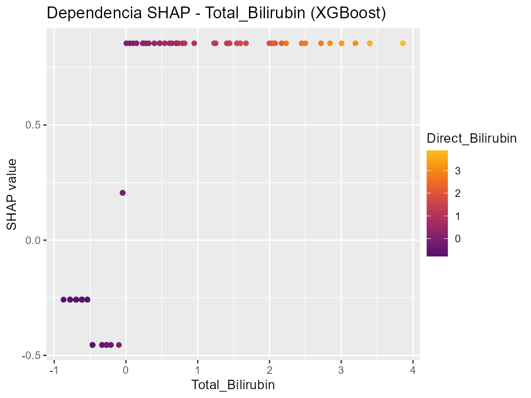 | 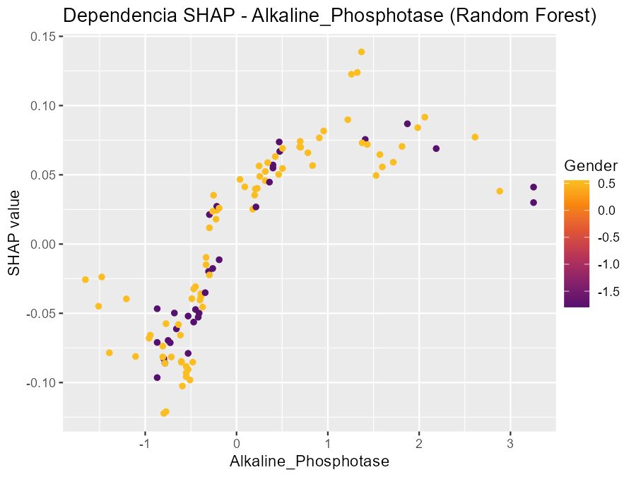 |
| 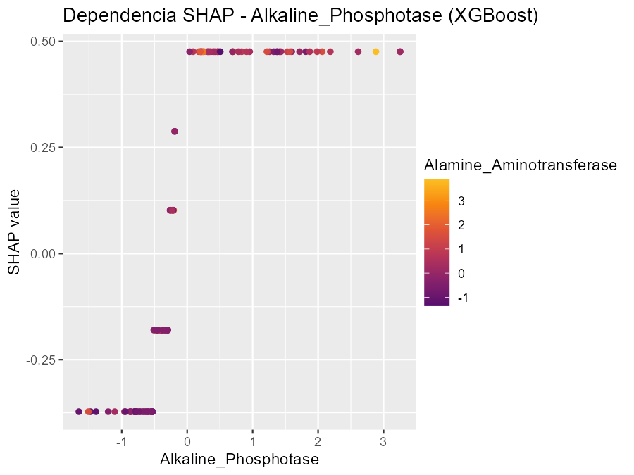 | 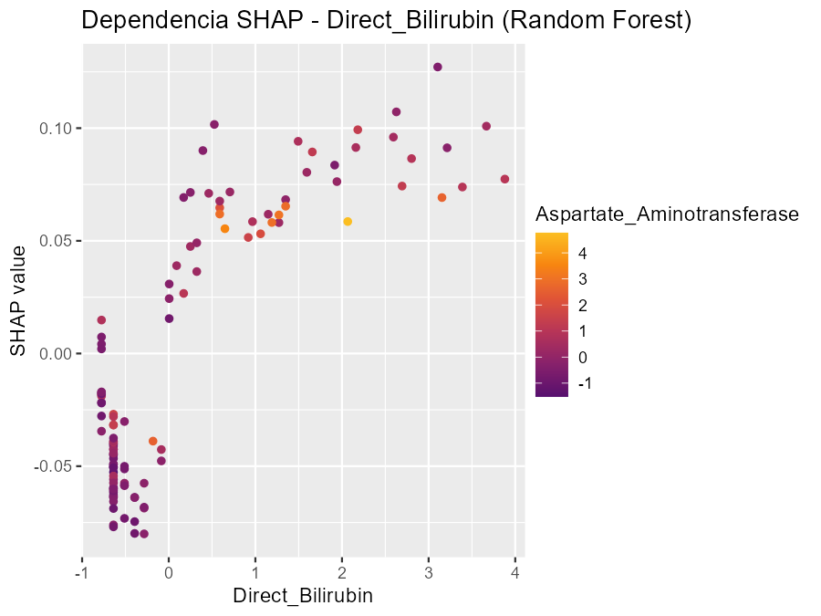 |

Os gráficos de dependência mostram a **forma funcional** da relação (eixo X = valor padronizado da variável, eixo Y = SHAP). A cor indica a variável com maior **interação**. Os demais estão em `plots/shap_dependencia_<m>_<var>.png`.

#### Explicações locais — pacientes individuais

| XGBoost — VP mais confiante | XGBoost — pior falso negativo |
|---|---|
| 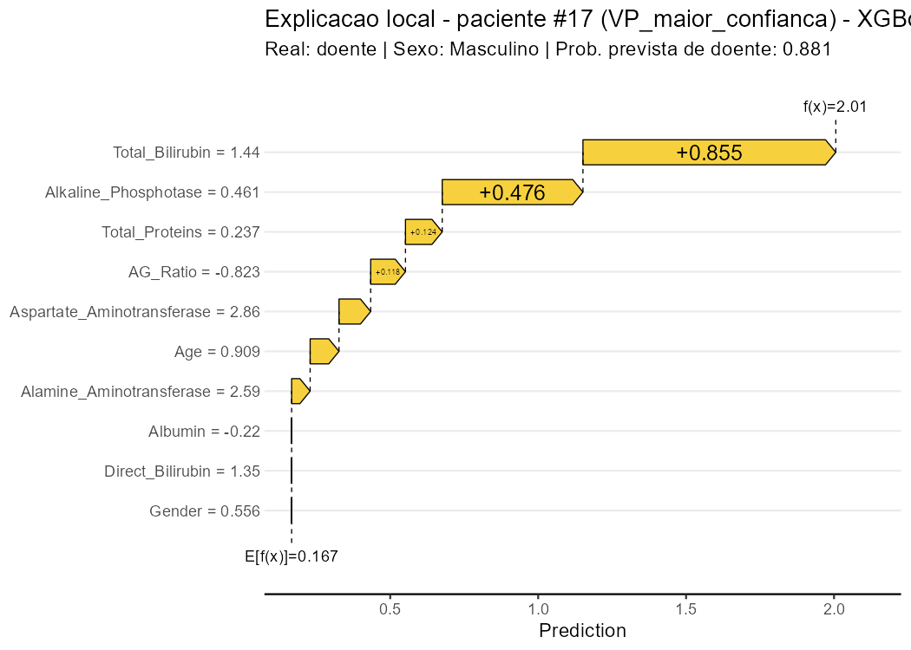 | 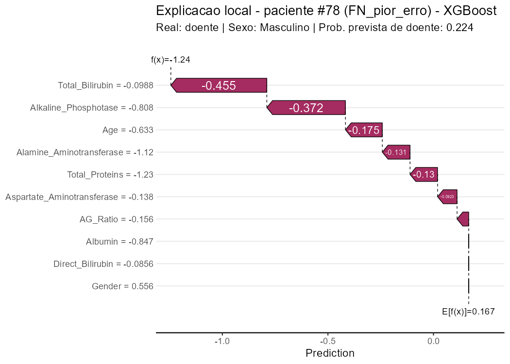 |

| Random Forest — VP mais confiante | Random Forest — pior falso negativo |
|---|---|
| 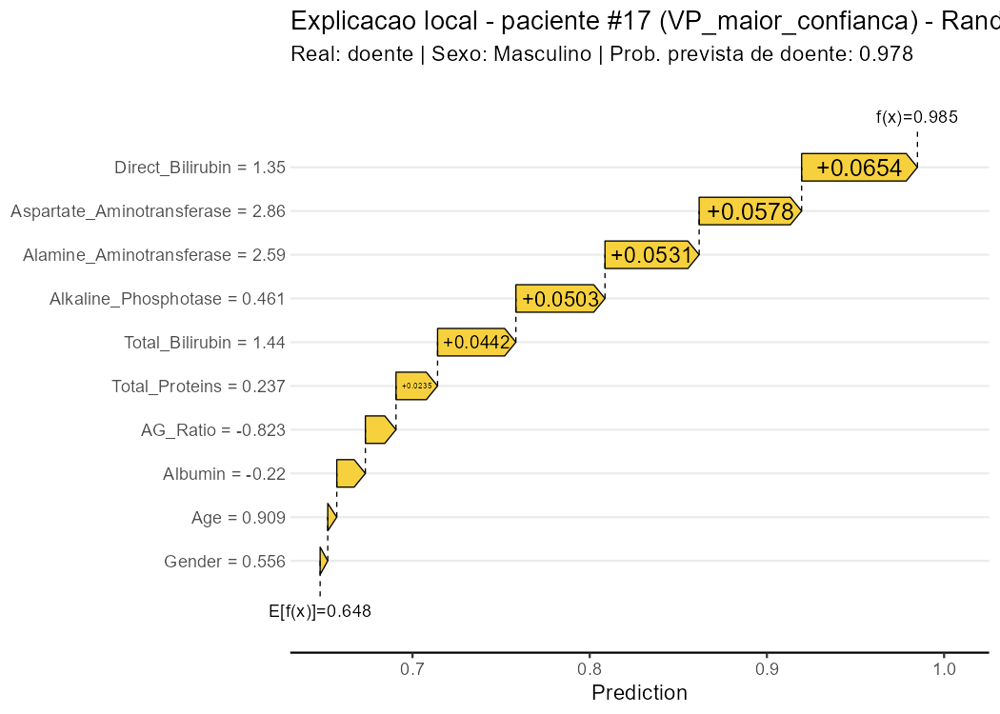 | 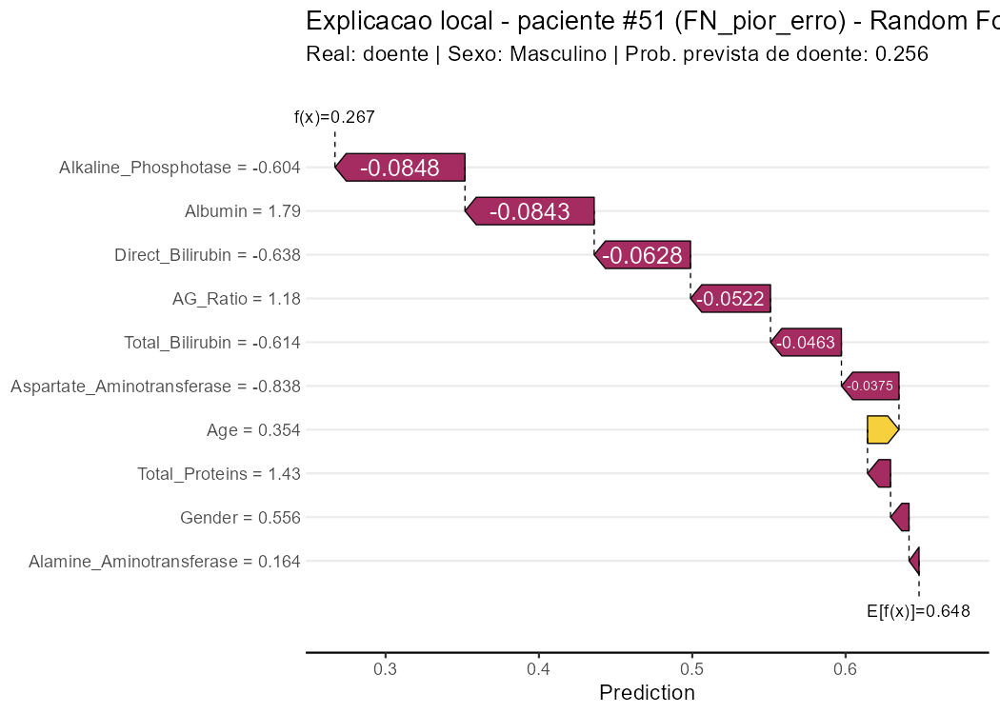 |

- **Paciente #17 (homem, doente)** é o verdadeiro positivo mais confiante **para os dois modelos** (prob. 0,88 no XGBoost, 0,98 no RF). No XGBoost a bilirrubina total é a maior contribuição (+0,86 log-odds); no RF, a bilirrubina direta (+0,065). Os modelos concordam no *porquê*.
- **Paciente #78 (homem, doente)** é o pior falso negativo do XGBoost (prob. 0,22): a **bilirrubina total baixa** (−0,46) é o principal fator que puxa para "saudável".
- **Paciente #51 (homem, doente)** é o pior falso negativo do Random Forest (prob. 0,26): a **fosfatase alcalina baixa** (−0,085) domina; só a idade (+0,021) aponta para doença.
- Em ambos os casos, o paciente tem **perfil laboratorial de pessoa saudável** nas variáveis que o modelo mais usa. Nenhum modelo baseado apenas nesses dez exames o classificaria corretamente — o SHAP **distingue um erro do modelo de uma limitação dos dados**.

#### SHAP estratificado por sexo

| XGBoost | Random Forest |
|---|---|
| 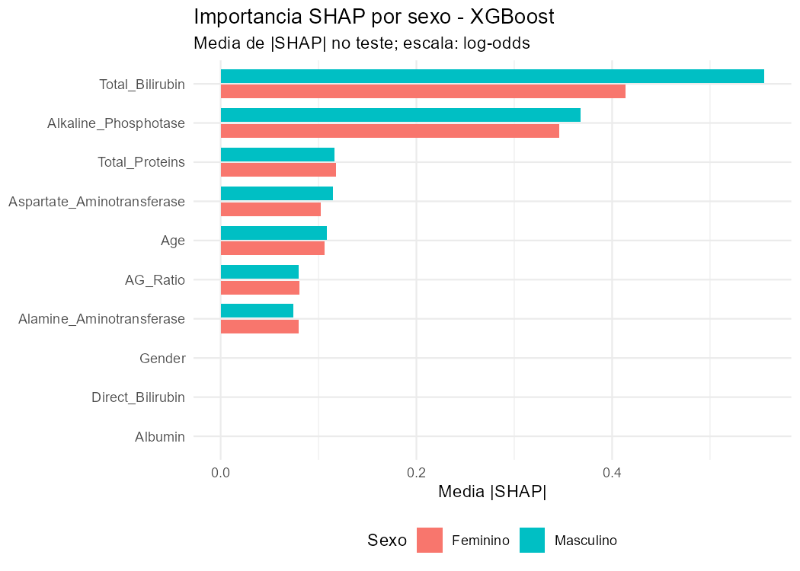 | 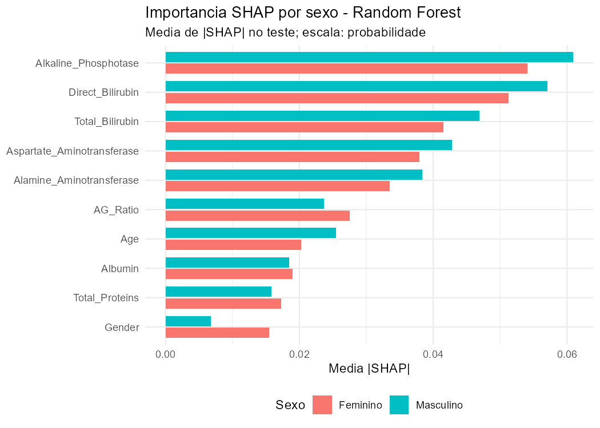 |
| 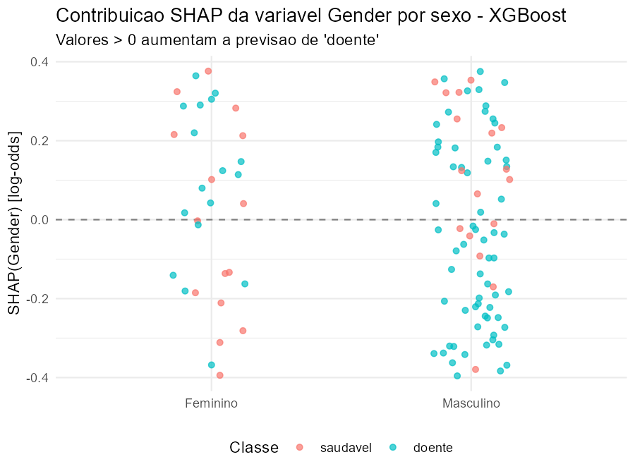 | 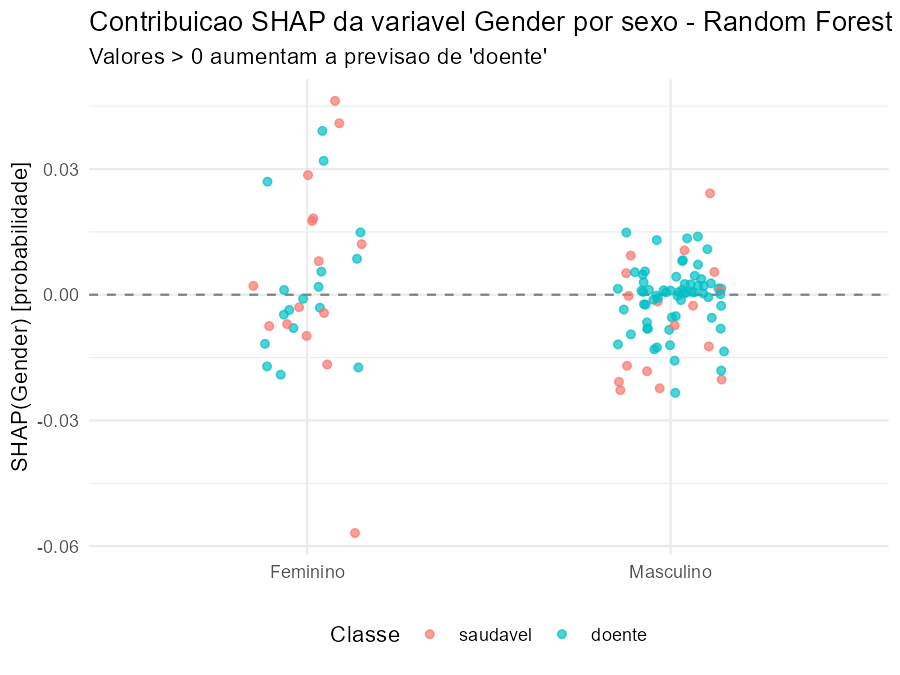 |

- **Concordância do ranking de importância entre mulheres e homens: Spearman = 0,988** nos dois modelos. Os modelos usam as variáveis na mesma ordem para os dois sexos — não há "lógica diferente" por grupo.
- **Contribuição média de `Gender`:** XGBoost = 0 (variável não usada); Random Forest = **+0,0035 para mulheres e −0,0018 para homens** (escala de probabilidade). Ou seja, o RF desloca o risco em menos de meio ponto percentual com base no sexo — na mesma direção do coeficiente da regressão logística (mulheres com risco ligeiramente maior, ajustado pelos exames), mas com magnitude desprezível.
- **Conclusão da auditoria:** o gap de sensibilidade do XGBoost entre sexos (Seção 7.4) **não** vem do uso direto da variável `Gender` — o modelo nem a usa. Vem da distribuição diferente dos exames entre homens e mulheres (fisiologicamente, mulheres têm valores de referência menores para fosfatase alcalina e transaminases), que o modelo trata com um único limiar. Isso é um argumento a favor de **limiares ou modelos específicos por sexo**, como sugerem Straw & Wu (2022).

#### Comparação dos rankings de importância entre métodos

| Variável | SHAP XGB | SHAP RF | Nativa RF | Nativa LightGBM | \|coef.\| RL |
|---|---|---|---|---|---|
| Total_Bilirubin | **1** | 3 | 5 | 3 | 8 |
| Alkaline_Phosphotase | 2 | **1** | **1** | 2 | 5 |
| Total_Proteins | 3 | 9 | 10 | 9 | **2** |
| Aspartate_Aminotransferase | 4 | 4 | 2 | 4 | 7 |
| Age | 5 | 7 | 6 | 5 | 6 |
| AG_Ratio | 6 | 6 | 7 | 7 | 3 |
| Alamine_Aminotransferase | 7 | 5 | 4 | 6 | 4 |
| Gender | 8 | 10 | 9 | 10 | 10 |
| Direct_Bilirubin | 9 | 2 | 3 | **1** | 9 |
| Albumin | 10 | 8 | 8 | 8 | **1** |

Correlação de Spearman entre rankings (`results/concordancia_rankings_spearman.csv`):

| | SHAP XGB | SHAP RF | Nativa RF | Nativa LGB | \|coef.\| RL |
|---|---|---|---|---|---|
| SHAP XGB | 1 | 0,36 | 0,26 | 0,31 | −0,25 |
| SHAP RF | | 1 | **0,92** | **0,95** | −0,16 |
| Nativa RF | | | 1 | 0,88 | −0,26 |
| Nativa LGB | | | | 1 | −0,26 |

Três leituras:

1. **SHAP do RF, importância nativa do RF e do LightGBM concordam fortemente (ρ ≥ 0,88)**: os modelos de árvore "olham" para os mesmos exames — fosfatase alcalina, bilirrubinas e transaminases.
2. **O XGBoost diverge (ρ ≈ 0,3)** não porque discorde da direção dos efeitos (Seção anterior), mas porque sua regularização eliminou variáveis redundantes e concentrou o crédito em `Total_Bilirubin`. É a mesma informação, atribuída de forma diferente.
3. **A regressão logística tem ranking negativamente correlacionado com todos os outros (ρ ≈ −0,2)**. `Albumin` e `Total_Proteins` são #1 e #2 pelo |coeficiente| mas estão no fundo das árvores; `Total_Bilirubin` é #1 no XGBoost mas #8 na RL. Isso **não** significa que a RL usa informação diferente: seus coeficientes gigantes e opostos em `Albumin`/`Total_Proteins` são um artefato da multicolinearidade (Seção 7.3). É a demonstração empírica de que **coeficientes de um modelo linear com preditores correlacionados não são uma medida confiável de importância** — e de por que o SHAP é preferível mesmo quando se compara com um modelo "interpretável".

### 7.6 Síntese dos resultados

1. **Todos os modelos superam o acaso** (AUC 0,74–0,78 no teste; nenhum IC 95% inclui 0,5), mas nenhum é excelente. O dataset é pequeno e o problema é genuinamente difícil.
2. **Não há evidência de que os modelos de caixa-preta superem a regressão logística.** Na CV honesta (SMOTE por fold) a RL é a melhor (0,753) e estatisticamente superior a XGBoost e LightGBM; no teste o RF lidera (0,781) mas nenhuma diferença é significativa (DeLong, todos p > 0,15). Para o objetivo 6 da proposta, o trade-off desempenho × interpretabilidade **favorece o modelo interpretável** neste dataset.
3. **O SMOTE antes da CV inflava a AUC dos ensembles em ~0,13** e produzia um ranking enganoso (árvores ≫ RL). Aplicá-lo dentro de cada fold é indispensável para uma comparação justa.
4. **O Random Search escolheu as configurações mais regularizadas** para os três ensembles — coerente com o sinal essencialmente aditivo dos dados.
5. **Perfil operacional é de triagem.** Garantir Sens ≥ 90 % custa Spec ≤ 0,31 em todos os modelos; o RF é o melhor nesse regime (10 FP a menos que RL/XGB). O limiar deve ser escolhido pelo custo relativo dos erros, não fixado em 0,5.
6. **Não há evidência de viés discriminatório por sexo na AUC** (todos p > 0,6), mas há **assimetrias de sensibilidade** — o XGBoost perde 35 % das mulheres doentes vs 27 % dos homens. O SHAP mostra que isso não vem do uso da variável `Gender` (irrelevante em todos os modelos), e sim das distribuições laboratoriais distintas entre sexos, sugerindo limiares específicos por sexo.
7. **O SHAP confirma a plausibilidade clínica** dos modelos (bilirrubinas, fosfatase alcalina e transaminases ↑ risco; albumina e razão A/G ↓ risco) e recupera a direção correta de `AG_Ratio`, que o coeficiente da RL inverte por multicolinearidade.
8. **Os erros mais graves (falsos negativos) são pacientes com exames normais** — uma limitação dos dados, não do algoritmo. O SHAP permite fazer essa distinção caso a caso.

---

## 8. Explicabilidade — como interpretar os gráficos SHAP

### A ideia em uma frase

O SHAP decompõe a previsão de **cada paciente** em uma soma de contribuições, uma por variável:

```
previsão (log-odds ou probabilidade) = valor base (média) + SHAP(Age) + SHAP(Albumin) + ... + SHAP(Gender)
```

- **SHAP > 0** → aquela variável, para aquele paciente, empurrou a previsão na direção de **"doente"**.
- **SHAP < 0** → empurrou para **"saudável"**.
- Quanto maior o módulo, maior o impacto.
- **Escala:** para XGBoost/LightGBM (TreeSHAP) os valores estão em **log-odds** (somam ao logit da probabilidade); para o Random Forest (`fastshap`) estão em **probabilidade**. Rankings e direções são comparáveis entre modelos; magnitudes absolutas não.

### `shap_importancia_<m>.png` — gráfico de barras

Média do |SHAP| de cada variável em todos os pacientes do teste. Barra maior = variável mais usada pelo modelo. **Não indica direção**, só magnitude.

### `shap_beeswarm_<m>.png` — "enxame de abelhas"

O gráfico mais informativo:

- **Cada linha** = uma variável (ordenada da mais para a menos importante).
- **Cada ponto** = um paciente do teste.
- **Posição horizontal** = valor SHAP (direita → mais risco de doença; esquerda → menos).
- **Cor** = valor da variável para aquele paciente (escala padronizada; cores quentes = alto, frias = baixo).

Como ler: se na linha de `Alkaline_Phosphotase` os pontos de cor quente (valor alto) estão à direita, então **fosfatase alcalina alta aumenta a probabilidade de doença**. Se em `Albumin` os pontos de cor quente estão à esquerda, **albumina alta protege**.

### `shap_dependencia_<m>_<variável>.png`

Eixo X = valor da variável; eixo Y = seu SHAP. Mostra a **forma** da relação: linear, com limiar, saturação, etc. A cor indica a variável com maior interação.

### `shap_waterfall_<m>_*.png` — explicação de um paciente

Começa no valor base (previsão média) e, barra a barra, mostra como cada variável somou ou subtraiu até chegar à previsão final daquele paciente. Três casos são gerados:

- `VP_maior_confianca`: doente que o modelo acertou com mais certeza — mostra o "perfil típico" de doença aprendido.
- `VN_maior_confianca`: saudável que o modelo acertou com mais certeza.
- `FN_pior_erro`: **doente que o modelo classificou como saudável com mais convicção** — o caso mais importante para análise crítica: quais exames "enganaram" o modelo?

### `shap_importancia_por_sexo_<m>.png` e `shap_gender_por_sexo_<m>.png` — auditoria de viés

- O primeiro compara a média de |SHAP| de cada variável calculada **só nas mulheres** e **só nos homens** do teste. Barras parecidas e ranking concordante (Spearman alto) indicam que o modelo aplica a mesma "lógica" aos dois grupos.
- O segundo mostra a contribuição da variável `Gender` para cada paciente, separada por sexo. Se os pontos de um sexo estão sistematicamente acima de zero e os do outro abaixo, o modelo está usando o sexo **por si só** para deslocar o risco — algo que deve ser confrontado com a prevalência real de doença em cada grupo (ver `results/metricas_por_sexo.csv`).

---

## 9. Decisões metodológicas e justificativas

| Decisão | Alternativa descartada | Justificativa |
|---|---|---|
| Split **antes** da imputação, da normalização e do SMOTE | Imputar/balancear/normalizar tudo e depois dividir | Evita vazamento de informação do teste para o treino |
| **SMOTE dentro de cada fold da CV** | SMOTE uma vez, antes da CV | Amostras sintéticas são interpolações de pacientes reais; se esses pacientes caem na partição de validação, a CV fica otimista e superestima os modelos flexíveis |
| SMOTE em vez de undersampling | Remover pacientes da classe majoritária | Dataset pequeno (570); descartar dados piora a variância |
| `log1p` nas variáveis assimétricas | Manter escala original | Reduz influência de outliers extremos e melhora modelos lineares e o cálculo de vizinhos do SMOTE |
| CV repetida 5×3 | CV simples 10 folds | Repetição reduz a variância da estimativa; com 457 obs, 5 folds mantém folds de tamanho razoável |
| **Random Search** (30 combinações) | Grade exaustiva | Cobre espaços contínuos (`eta`, `learning_rate`, `subsample`) com custo fixo; a literatura mostra eficiência igual ou superior à grade para o mesmo orçamento (Bergstra & Bengio, 2012) |
| AUC como métrica de seleção + **limiar clínico** (Sens ≥ 90 %) | Acurácia; ou otimizar Recall diretamente | Acurácia é enganosa em dados desbalanceados; otimizar Recall puro leva ao modelo trivial "todos doentes". A AUC escolhe o modelo com melhor ordenação e o limiar clínico traduz isso em Recall alvo |
| Teste de DeLong e t pareado | Comparar apenas médias | Diferenças de AUC de poucos centésimos podem ser ruído; testes estatísticos deixam isso explícito |
| **Estratificação por sexo** (métricas, ROC, SHAP) | Avaliar só no agregado | Prevalência e perfil laboratorial diferem entre sexos; um modelo pode ter FN concentrados em um grupo sem que a métrica global revele (Straw & Wu, 2022) |
| SHAP em vez de só importância nativa | `varImp()` do caret | SHAP fornece direção do efeito, explicações locais e é consistente entre modelos |
| **TreeSHAP exato** para XGBoost/LightGBM | Monte Carlo (`fastshap`) para todos | Exato, determinístico e instantâneo; `fastshap` fica reservado ao Random Forest, que não tem TreeSHAP nativo em R |
| SHAP em **XGB + RF + melhor modelo** | Explicar só um modelo | Compara se modelos diferentes "olham" para os mesmos exames; evita explicar um modelo que não é o melhor no teste |
| LightGBM via wrapper customizado no caret | Treinar fora do caret | Garante que o LightGBM use exatamente os mesmos folds e a mesma métrica dos outros modelos |
| Análise de limiar para todos os modelos | Fixar 0,5 | Em triagem, o custo de FN ≠ custo de FP; o limiar é uma decisão clínica, não estatística |

---

## 10. Limitações e trabalhos futuros

**Limitações**

- Amostra pequena (113 pacientes de teste; 32 mulheres) → intervalos de confiança largos; nenhuma diferença entre modelos, nem entre sexos, foi significativa.
- Dataset de uma única região geográfica — generalização para outras populações não é garantida.
- O rótulo "doente" agrupa diferentes patologias hepáticas.
- SMOTE gera amostras por interpolação linear, o que pode criar pacientes fisiologicamente implausíveis.
- Random Search com 30 combinações explora o espaço de hiperparâmetros de forma limitada; a seleção do modelo ainda é feita na mesma CV usada para o tuning (sem CV aninhada), o que pode manter leve otimismo.
- Os valores SHAP do Random Forest são aproximados (Monte Carlo) e estão em escala diferente (probabilidade) dos de XGBoost/LightGBM (log-odds).
- Especificidade baixa em todos os modelos no limiar 0,5, e muito baixa no limiar clínico de Sens ≥ 90 %.

**Possíveis extensões**

- Validação cruzada aninhada (nested CV) para estimativa não enviesada do desempenho após tuning.
- Otimização bayesiana de hiperparâmetros (ex.: `tune`/`mlr3` ou `rBayesianOptimization`) em substituição ao Random Search.
- Calibração de probabilidades (Platt scaling / isotônica) e curva de calibração, inclusive por sexo.
- Modelos treinados separadamente por sexo ou com reponderação, para testar se reduzem o gap de FN (Straw & Wu, 2022).
- Engenharia de atributos com razões clínicas conhecidas (ex.: AST/ALT — razão de De Ritis).
- Ensemble (stacking) dos quatro modelos.
- Curvas de decisão (decision curve analysis) para avaliar utilidade clínica em vez de só desempenho estatístico.
- Validação externa em outro dataset hepático.

---

## 11. Referências

- Ramana, B. V., Babu, M. S. P., & Venkateswarlu, N. B. (2012). *ILPD (Indian Liver Patient Dataset)*. UCI Machine Learning Repository. https://archive.ics.uci.edu/dataset/225
- Chawla, N. V., Bowyer, K. W., Hall, L. O., & Kegelmeyer, W. P. (2002). SMOTE: Synthetic Minority Over-sampling Technique. *Journal of Artificial Intelligence Research*, 16, 321–357.
- Breiman, L. (2001). Random Forests. *Machine Learning*, 45(1), 5–32.
- Chen, T., & Guestrin, C. (2016). XGBoost: A Scalable Tree Boosting System. *KDD '16*.
- Ke, G. et al. (2017). LightGBM: A Highly Efficient Gradient Boosting Decision Tree. *NeurIPS 30*.
- Lundberg, S. M., & Lee, S.-I. (2017). A Unified Approach to Interpreting Model Predictions. *NeurIPS 30*.
- DeLong, E. R., DeLong, D. M., & Clarke-Pearson, D. L. (1988). Comparing the areas under two or more correlated ROC curves. *Biometrics*, 44(3), 837–845.
- Kuhn, M. (2008). Building Predictive Models in R Using the caret Package. *Journal of Statistical Software*, 28(5).
- Youden, W. J. (1950). Index for rating diagnostic tests. *Cancer*, 3(1), 32–35.
- Bergstra, J., & Bengio, Y. (2012). Random Search for Hyper-Parameter Optimization. *Journal of Machine Learning Research*, 13, 281–305.
- Lundberg, S. M., Erion, G. G., & Lee, S.-I. (2018). Consistent Individualized Feature Attribution for Tree Ensembles. *arXiv:1802.03888* (TreeSHAP).
- Straw, I., & Wu, H. (2022). Investigating for bias in healthcare algorithms: a sex-stratified analysis of supervised machine learning models in liver disease prediction. *BMJ Health & Care Informatics*, 29(1), e100457.
- Santos, M. S., Soares, J. P., Abreu, P. H., Araújo, H., & Santos, J. (2018). Cross-Validation for Imbalanced Datasets: Avoiding Overoptimistic and Overfitting Approaches. *IEEE Computational Intelligence Magazine*, 13(4), 59–76.
